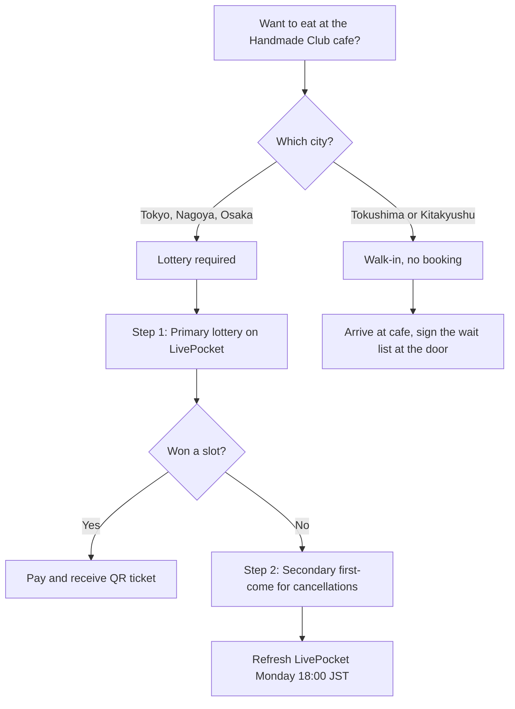

<strong>Disclosure:</strong> This article contains affiliate links. We may earn a commission if you book through these links, at no extra cost to you.

*Photo: takeya manai (N708) / [Wikimedia Commons](https://commons.wikimedia.org/wiki/File:Ufotable_Cafe_TOKYO.png), CC BY-SA 4.0. Storefront of ufotable Cafe Tokyo on the Nagata Building ground floor in Nogata — the Tokyo lottery venue for the Demon Slayer Handmade Club 2026 run, three minutes from Nogata Station on the Seibu Shinjuku Line.*

**ufotable Cafe is launching a brand-new Demon Slayer collaboration on April 28, 2026** — the "Handmade Club" (ハンドメイドクラブ), a craft-themed takeover that runs through **May 31** at all **7 ufotable Cafe and Machiasobi Cafe venues** across Tokyo, Nagoya, Osaka, Tokushima, and Kitakyushu. The hook is a pour-your-own-sauce menu where you finish the plate yourself, **5 brand-new seasonal cloth patterns** (Strawberry Festival, Fireworks, Autumn Harvest, Halloween, Christmas) drawn from character costume motifs, and ribbon rolls plus actual fabric you can take home for your own crafts. Lottery booking opens through **LivePocket** for the Tokyo, Nagoya, Osaka, and Machiasobi Tokyo cafes; Tokushima, Bizan, and Kitakyushu stay walk-in. **Machiasobi vol.30** on **May 16 and 17** in Tokushima adds a separate workshop slot at the Amico Building. This guide covers the official source page, every venue, the lottery flow in plain English, and what is worth your craft budget.

<strong>"Demon Slayer Handmade Club" (鬼滅の刃 ハンドメイドクラブ) is the spring 2026 ufotable Cafe collaboration tied to the Demon Slayer (*Kimetsu no Yaiba*, 鬼滅の刃) franchise — running April 28 to May 31, 2026 across 7 ufotable Cafe and Machiasobi Cafe venues, with original "minicara" character illustrations in handicraft poses, 5 seasonal cloth-pattern goods, and a craft-themed menu where guests apply sauces and toppings themselves.</strong>

**Planning the Tokyo cafe day around it?** Klook sells the [Tokyo Subway 24-hour Ticket from 800 yen](https://www.klook.com/en/activity/1780-tokyo-subway-ticket/?aff_id=1251547&aff_label=demon-slayer-handmade-club-top) in English with QR-ticket delivery — it covers the Marunouchi-to-Seibu Shinjuku transfer that gets you to Nogata Station. Walk three minutes from the south exit and you are at the cafe door.

## At a Glance

<ResponsiveTable label="Demon Slayer Handmade Club at ufotable Cafe at a glance">

| Detail | Info |
| --- | --- |
| Target Reader | Demon Slayer fans visiting Japan in late April or May 2026 who want a craft-themed cafe experience that doubles as a souvenir-shopping run |
| Best Time to Visit | Weekday lunch slots at the walk-in venues (Tokushima, Bizan, Kitakyushu) — zero lottery stress and full merch access |
| Budget | **2,200 to 4,500 yen** per person (1 plate + 1 drink + 1 cloth-pattern goods item) |
| Must-Do | Order the pour-your-own craft plate, pick up the Strawberry Festival or Fireworks ribbon roll, and take a free placemat home |
| English Support | No English menu in store — Google Translate handles the LivePocket flow if you screen-share with the camera tool |
| Event Dates | April 28 to May 31, 2026 (Machiasobi vol.30 workshop: May 16 and 17 only) |

</ResponsiveTable>

## What Is the Demon Slayer Handmade Club?

This is a craft-themed cafe takeover, not a story-arc rerun. Where the spring "Bonds Tied" collaboration kept its drinks tied to the TV broadcast schedule, Handmade Club leans into ufotable's design side — the studio's own animators have drawn a new "minicara" set of the Demon Slayer cast in handicraft poses, with the costume motifs of each character translated into 5 reusable cloth patterns you can buy at the cafe. **The conceit is that you finish the dish yourself**, pouring sauces or arranging toppings the way a craft project asks you to glue, stitch, or fold.

The official source is the [ufotable Cafe news page for "Demon Slayer Handmade Club 2026"](https://www.ufotable.co.jp/cafe/4929/), which confirms the April 28 to May 31 run and the venue list. The dedicated event page at [ufotable.co.jp/kimetsu/event/handmadeclub2026/](https://www.ufotable.co.jp/kimetsu/event/handmadeclub2026/) is where the menu, goods, and drink lineup are kept up to date as new items drop. [Collabo-cafe.com's coverage of the event](https://collabo-cafe.com/events/collabo/kimetsu-handmade-ufotable-cafe-2026/) mirrors the lineup with sell-out flags as the run progresses.

Visitors who attended the spring "Bonds Tied" rerun report that the Tokyo location had a small "coming soon" panel teasing the cloth patterns ahead of the launch — the Strawberry Festival design in particular reportedly catches the light because the print is described as using a glossy ribbon weave rather than flat cotton. If you only have one cafe slot in Tokyo this trip, the Handmade Club run is timed exactly for Golden Week travelers and is worth defending on your itinerary.

## What Is on the Menu? (Pour-Your-Own Plates)

The headline format is a "kake-jibun" plate — you receive the dish nearly finished and apply the sauce, dressing, or topping yourself at the table, the same way a craft kit asks you to make the last move. ufotable confirmed on the [official menu page](https://www.ufotable.co.jp/kimetsu/event/handmadeclub2026/) that each plate ships with **two sauces to choose between**, and that the actual food specs may shift as restock happens during the 5-week run.

Because the menu page may evolve, treat the food prices below as the early-run figures from past ufotable Cafe collaborations — confirm at the cafe register before you sit down.

<ResponsiveTable label="Handmade Club menu structure at ufotable Cafe">

| Course | Format | Approximate Price | What to Expect |
| --- | --- | --- | --- |
| Pour-your-own savory plate | Choose one of two sauces, finish at table | **1,300 to 1,500 yen** | Themed around a character's costume or weapon motif, served with a printed art card |
| Pour-your-own dessert | Choose syrup or topping, finish at table | **1,200 to 1,400 yen** | Often a parfait or panna cotta with the seasonal pattern as plating |
| Character pair drink | Pre-set, comes with a coaster | **650 to 750 yen** | Drink lineup rotates with the seasonal cloth pattern — a "Strawberry Festival" drink anchors the early phase |

</ResponsiveTable>

<strong>Pro tip:</strong> Order the savory plate first and ask the staff which sauce they recommend that day. ufotable Cafe staff at the Tokyo and Osaka locations will quietly tell you which option photographs better against the seasonal placemat — the one detail you cannot get from the menu sheet.

**Every cafe order earns you a printed novelty.** The placemat is per-visit, the coaster is per-drink, and the food card is per-plate. Stack two drinks and a plate to leave with three exclusive pieces of art — that is the math the regulars are doing.

## Where Are the Seven Venues?

*Photo: Asanagi / [Wikimedia Commons](https://commons.wikimedia.org/wiki/File:Nogata_Station_south_entrance_2024-03-10.jpg), CC0.*

The collaboration runs across 7 venues in 5 cities. Three locations require advance lottery reservations through LivePocket. Four locations stay walk-in for the entire run — the same access pattern ufotable used for the spring rerun.

| Venue | Address | Nearest Station | Reservation |
| --- | --- | --- | --- |
| **ufotable Cafe Tokyo** | Nakano-ku, Nogata 1-38-11, Nagata Bldg 1F | Nogata Station (Seibu Shinjuku Line), 3-min walk | Required (lottery) |
| **Machiasobi Cafe Tokyo** | Nakano-ku, Nogata 1-38-11, Nagata Bldg 2F | Nogata Station, 3-min walk | Required (lottery) |
| **ufotable Cafe Nagoya / Machiasobi Cafe Nagoya** | Nakamura-ku, Takehashi-cho 14-1 | Nagoya Station, 10-min walk | Required (lottery) |
| **ufotable Cafe Osaka / Machiasobi Cafe Osaka** | Naniwa-ku 3-3-3, 1F | Namba Station (various lines), 8-min walk | Required (lottery) |
| **ufotable Cafe Tokushima** | Higashi-senba-cho 1-13, Kokusai Bldg 2F | Tokushima Station, 10-min walk | Walk-in (no reservation) |
| **Machiasobi Cafe Bizan** | Bizan-cho, Moge-gawara 1 | Tokushima Station, 15-min walk | Walk-in (no reservation) |
| **ufotable Cafe Kitakyushu / Machiasobi Cafe Kitakyushu** | Kokurakita-ku, Asano 2-14-5, Aruaru City 2F | Kokura Station (JR), 5-min walk | Walk-in (no reservation) |

**For most overseas visitors the Tokyo cafe in Nogata is the obvious pick** — three minutes on foot from a Seibu Shinjuku Line station that runs an express direct from Shinjuku in 15 minutes. The walk takes you past a tiny shotengai with two ramen shops and a 100-yen coin laundry; the cafe is on the ground floor of the Nagata Building, and the line forms outside on collaboration days.

If your itinerary already covers Kansai, the Osaka cafe is an 8-minute walk from Namba and lines up well with a Den Den Town shopping afternoon. The Tokushima cafe is the deep-cut: it sits in ufotable's hometown, the staff are sometimes the production crew themselves, and there is no lottery to fight.

**Hopping between cities to compare cafes?** A [Japan Rail Pass via Klook](https://www.klook.com/en/activity/24172-jr-pass-japan-rail-pass-japan/?aff_id=1251547&aff_label=demon-slayer-handmade-club-mid) covers the Shinkansen between Tokyo, Nagoya, Osaka, and Kitakyushu — the four bullet-train cities with ufotable venues. A 7-day pass at **50,000 yen** clears its cost as soon as you do Tokyo to Osaka and back.

## How Do I Book the Lottery?

The lottery uses LivePocket, the same Japanese ticketing platform ufotable has run for past collaborations. Bookings open in two stages.

**Step 1 — Primary Lottery.** Submissions open every Thursday at **18:00 JST** on LivePocket and close Sunday at **23:59 JST**. Pick a 90-minute slot, pick a venue, and submit up to 2 guests per ticket. Results arrive by **Monday 12:00 JST** and unsuccessful entries pay nothing.

**Step 2 — Secondary First-Come.** Cancelled or unfilled slots open at Monday **18:00 JST** on the same LivePocket page, first-come, no lottery. Stock disappears in under five minutes for the Tokyo cafe.

**Walk-in venues.** Tokushima, Bizan, and Kitakyushu use a paper wait list at the door. Show up before opening and you are typically in for the first session of the day — no app needed.

<strong>Heads up:</strong> LivePocket is Japanese-only and requires either a Japanese phone number or an SNS login (LINE, Twitter/X, or Yahoo Japan). Set Google Translate to camera mode and screen-share the page if your hotel concierge cannot help. Foreign credit cards work at the payment step, but the registration form does not.

**The booking move that works most reliably:** Set a phone alarm for 17:55 JST every Thursday, sign in to LivePocket beforehand, and have the venue and date pre-selected. Submit at 18:00 sharp for a weekday lunch slot — those compete the lightest. Saturday dinner slots typically fill within two minutes of the lottery opening, per repeat-bookers' reports on Japanese fan sites.

## What Goods Should I Buy?

*Photo: Dick Thomas Johnson / [Wikimedia Commons](https://commons.wikimedia.org/wiki/File:Animate_Ikebukuro_20120613_2.jpg), CC BY 2.0.*

The cloth patterns are the headline souvenir. ufotable confirmed **5 seasonal designs** drawn from character costumes, sold as ribbon rolls and pre-cut fabric you can use for your own crafts at home — the franchise's first foray into an actual handmade-supplies lineup.

<ResponsiveTable label="Demon Slayer Handmade Club merchandise structure">

| Item | Approximate Price | What You Get |
| --- | --- | --- |
| Seasonal cloth (pre-cut) | **1,200 to 1,800 yen** | One pattern (Strawberry Festival, Fireworks, Autumn Harvest, Halloween, or Christmas) — usable for masks, pouches, scrunchies |
| Ribbon roll | **800 to 1,200 yen** | The same design as a ribbon — pairs with the cloth or stands alone |
| Handmade apron | **3,500 to 4,500 yen** | Adult-size apron printed with the seasonal pattern |
| Handkerchief-style memo pad | **600 to 900 yen** | Small souvenir, easy to pack, ships well |
| Acrylic stand (minicara) | **1,500 to 1,800 yen** | The new craft-pose drawdowns of the main cast |

</ResponsiveTable>

The fabrics and ribbons are also available for **pre-order on the global ufotable webshop** — useful if your slot fills before you can walk in. The [Strawberry Festival cloth product page](https://webshop-global.ufotable.co.jp/products/pre-orderseasonal-design-cloth-strawberry-festival-version-demon-slayer-kimetsu-no-yaiba-craft-club-2026-merchandise) and the [Halloween cloth listing](https://webshop-global.ufotable.co.jp/products/pre-orderseasonal-design-cloth-halloween-version-demon-slayer-kimetsu-no-yaiba-craft-club-2026-merchandise) both ship internationally with a clear English checkout.

**Cafe diners get first stock access.** Merch-only visitors are admitted 30 minutes after each session begins, the same rule as the spring rerun, so the lottery winners scoop the popular patterns before walk-up shoppers see them.

## What Is the Machiasobi vol.30 Workshop?

Machiasobi (マチ★アソビ) is the twice-yearly anime festival held in Tokushima City — ufotable's home turf. The May 2026 edition, vol.30, runs **May 16 and 17** and lists the Handmade Club workshop among its program, hosted in the **Amico Building 4F special booth** (アミコビル4F) in central Tokushima. ufotable confirmed in [a public X post](https://x.com/ufotable/status/1978025805037842469) that the booth is **fully reservation-only** for the workshop slots — no walk-up admission, even on the festival floor.

According to the [Machiasobi vol.30 official site](https://www.machiasobi.com/), this edition is the largest yet, with over 100 events programmed across the city. Pair the workshop with a full afternoon at the ufotable Cafe Tokushima and a stop at Machiasobi Cafe Bizan for one of the densest single-day Demon Slayer itineraries available in Japan this year.

The Tokushima trip is also the easiest place to snag the cloth patterns without a lottery — the walk-in venues stock the same merch as the lottery cafes. If your travel window overlaps with vol.30, this is the smarter route.

**Need a Tokushima base for the festival?** [Booking.com lists Tokushima Station hotels from 6,500 yen a night](https://www.booking.com/searchresults.en-gb.html?ss=Tokushima+Station&aid=placeholder&aff_label=demon-slayer-handmade-club-bottom) — within a 10-minute walk of both ufotable Cafe Tokushima and the Amico Building. Booking the night before vol.30 saves you the morning Shinkansen rush.

## Why Japanese People Love This

*Photo: Kakidai / [Wikimedia Commons](https://commons.wikimedia.org/wiki/File:Sunshine_City_2012.JPG), CC BY-SA 3.0.*

Demon Slayer's domestic fandom moved past pure character merchandise years ago. The genre Japanese fans now call "*tezukuri suru oshikatsu*" (手作り推し活) — literally "fan activity you make by hand" — has been spreading across Twitter and Instagram for the past two years, with fans sewing their own *itabag* pouches, knitting hashira-themed scarves, and decorating mask wires with character ribbons.

Handmade Club leans directly into that scene. By selling actual fabric and ribbon — not just a finished plushie — ufotable is giving Japanese fans the materials to keep making things long after the cafe run ends. The pour-your-own-sauce plate format is the same idea on a tiny scale: even the meal becomes a craft you finish yourself. That is why this collaboration feels different from a typical anime cafe rerun and why the early reaction on Japanese fan sites has been about the cloth patterns, not the food.

## How Does Handmade Club Compare to the Spring "Bonds Tied" Rerun?

<ResponsiveTable label="Comparison between the Handmade Club and Bonds Tied collaborations">

| Factor | Handmade Club (Apr 28 – May 31) | Bonds Tied Rerun (Mar 31 – May 6) |
| --- | --- | --- |
| Theme | Craft-themed minicara, customer finishes plate | TV rebroadcast pair drinks, full Tanjiro arc |
| Menu format | Pour-your-own savory and dessert plates | Set drinks and bowls, no DIY element |
| Souvenir hook | 5 seasonal cloth patterns and ribbons | Coasters, acrylic stands, bromides |
| Workshop | Yes (Machiasobi vol.30 Tokushima, May 16 to 17) | No |
| Verdict | Best for craft fans and souvenir hunters | Best for fans following the broadcast schedule |

</ResponsiveTable>

If you cannot lock in a slot, [the Animate Cafe chain](/articles/animate-cafe-guide-japan) keeps an easier first-come booking system and runs a Demon Slayer collaboration most months. For the fabric-first goods angle, Handmade Club is the only ufotable run this year with that hook — the rerun did not stock craft supplies.

## FAQ: Demon Slayer Handmade Club

<h3 itemProp="name">FAQ: When does the Demon Slayer Handmade Club run?</h3>

The collaboration runs from April 28 through May 31, 2026, at 7 ufotable Cafe and Machiasobi Cafe venues across Tokyo, Nagoya, Osaka, Tokushima, and Kitakyushu. The Machiasobi vol.30 workshop in Tokushima is a separate session held on May 16 and 17 only, in the Amico Building.

<h3 itemProp="name">FAQ: Do I need a reservation for every venue?</h3>

No. Tokyo (Nogata), Nagoya, Osaka (Namba), and Machiasobi Cafe Tokyo require an advance LivePocket lottery booking. Tokushima, Machiasobi Cafe Bizan, and Kitakyushu (Aruaru City) accept walk-ins all run, with a paper wait list at the door. If you cannot get through the Japanese-only LivePocket flow, the walk-in venues are the safer plan.

<h3 itemProp="name">FAQ: How much should I budget per visit?</h3>

Plan for 2,200 to 4,500 yen per person. A pour-your-own savory plate is roughly 1,300 to 1,500 yen, a character pair drink is 650 to 750 yen, and a single piece of cloth-pattern goods runs 1,200 to 1,800 yen. Add 3,500 yen if you want the handmade apron in your bag at the end of the visit.

<h3 itemProp="name">FAQ: Can I buy the goods if I do not eat at the cafe?</h3>

Yes. Each cafe session admits merch-only visitors 30 minutes after the dining slot opens, on a first-come basis. The popular cloth patterns (Strawberry Festival, Fireworks) often sell out the same day, so buying through the global ufotable webshop pre-order is the safer route if you cannot arrive at opening.

<h3 itemProp="name">FAQ: Is the Machiasobi vol.30 workshop open to overseas visitors?</h3>

Yes, but only with an advance reservation. ufotable confirmed on its official X account that the Amico Building booth is fully reservation-only for both days. Bookings open closer to the festival on the Machiasobi site at machiasobi.com — check the program page in the first week of May for the registration link.

**Ready to lock in your craft-cafe day?** [Browse Tokyo collab cafe experiences on Klook](https://www.klook.com/en/city/28-tokyo-things-to-do/?aff_id=1251547&aff_label=demon-slayer-handmade-club-flagship) — bookable in English with free cancellation, plus the city's anime walking tours that pair with a Nogata cafe afternoon. Combine the Handmade Club visit with a Demon Slayer pilgrimage walk in Asakusa for a full fan day.

## More Collab Cafe Guides

- [Demon Slayer Rerun Cafe at ufotable 2026](/articles/demon-slayer-rerun-cafe-ufotable-kizuna-2026) — The companion "Bonds Tied" collaboration through May 6
- [How to Book Anime Collab Cafes in Japan](/articles/how-to-book-anime-collab-cafe-japan) — Reservation walkthrough for every major chain
- [JJK 5th Anniversary Sweets Paradise 2026](/articles/jjk-sweets-paradise-complete-guide-2026) — The other big spring 2026 cafe rollout
- [Tokyo Anime Collab Cafes Spring 2026](/articles/tokyo-anime-collab-cafes-spring-2026) — Everything else open this season
- [Golden Kamuy Golden Week Shinjuku Popup 2026](/articles/golden-kamuy-golden-week-shinjuku-popup-2026) — The walk-in two-floor Kabukicho popup, complementary to this reservation-driven run
- [Re:Zero × Cure Maid Café Akihabara 2026 Visitor Guide](/articles/re-zero-curemaid-cafe-akihabara-2026) — Sister Tokyo single-venue collab cafe, 19-day GW window, walk-in friendly weekdays
- [Ranma 1/2 Japan 2026 Exhibition + Tree Village Pop-Up Guide](/articles/ranma-japan-2026-exhibition-tree-village-guide) — Sister Tokyo experience event chain spanning Ikebukuro Sunshine City and Tokyo Skytree Town Solamachi
- [Ouran Host Club 20th Anniversary Cafes 2026](/articles/ouran-host-club-20th-anniversary-cafes-2026) — Anniversary cluster sister; three parallel venues at motto cafe Osaka, Tree Village Tokyo Skytree, and Tree Village Osaka + Hakata legs
- [Animate Cafe Guide Japan](/articles/animate-cafe-guide-japan) — The chain with the easiest first-come booking
- [Lawson Ticket Anime Cafe Booking](/articles/lawson-ticket-anime-cafe-booking) — Backup booking platform when LivePocket is blocked
- [Osaka Anime Cafes Complete Guide 2026](/articles/osaka-anime-cafes-complete-guide-2026) — The Kansai sister itinerary

<strong>Follow <a href="https://www.threads.net/@pop_now_jp" rel="nofollow" target="_blank">@pop_now_jp on Threads</a></strong> for daily Tokyo pop culture updates.

