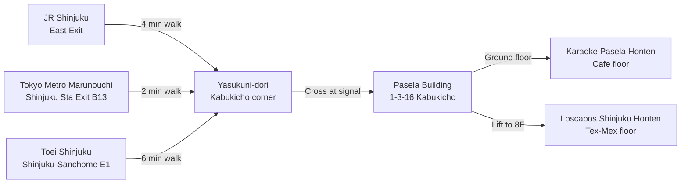

<em>Last updated: April 2026.</em>

<strong>Disclosure:</strong> This article contains affiliate links. We may earn a commission if you book through these links, at no extra cost to you.

*Photo: RuinDig (Yuki Uchida) / [Wikimedia Commons](https://commons.wikimedia.org/wiki/File:JR-Shinjuku-Station-East---2024-03-27_12.jpg), CC BY 4.0. JR Shinjuku Station east exit and the Cross Shinjuku Vision 3D billboard — exit here and walk four minutes north on Yasukuni-dori to reach the Pasela / Loscabos building hosting the Golden Kamuy "Golden Week Conquest Battle" popup.*

**The Golden Kamuy "Golden Week Conquest Battle" popup opens today**, April 28, and runs through **May 27, 2026** — a full month that bridges Golden Week, the post-GW lull, and the lead-in to the Final Season's mid-season pause. The collab is split across two same-building venues in Kabukicho — **Karaoke Pasela Shinjuku Honten on the ground floor and Loscabos Shinjuku Honten on the 8th floor at 1-3-16 Kabukicho**, four minutes from JR Shinjuku Station east exit. Both floors run their own collab menu pulled from the Final Season drawdown, **every collab order earns one free coaster**, original goods drop in waves, and a life-size higuma (brown bear) standee plus the **"Find Shiraishi the Escape King"** in-store experience event anchor the photo route. The wordplay is on the nose — **Golden Kamuy + Golden Week** — and the Hokkaido + Ainu setting makes this the rare anime cafe that cleanly bridges into a real travel itinerary north of Honshu. Here is the Kabukicho walking route, the verified menu and prices, the coaster rule, and how to thread it into a Hokkaido follow-on trip.

<strong>"TV Anime Golden Kamuy × Karaoke Pasela Shinjuku Honten / Loscabos Shinjuku Honten" (アニメ「ゴールデンカムイ」× 新宿パセラ・ロスカボス) is the spring 2026 Golden Kamuy two-venue popup in Kabukicho — running April 28 to May 27, 2026 with original food and drink menus on each floor, a free coaster per collab item ordered, original goods sales, a life-size higuma photo spot, and the "Find Shiraishi" experience event timed to the Final Season "Tokyo Love Story Arc."</strong>

**Booking the day around it?** Klook sells the [Tokyo Subway 24-hour Ticket from 800 yen](https://www.klook.com/en/activity/1780-tokyo-subway-ticket/?aff_id=1251547&aff_label=golden-kamuy-shinjuku-popup-2026-top) in English with QR delivery — Marunouchi or Shinjuku Line drops you at Shinjuku Station, four minutes from the building. Same pass also covers a same-day jump to Ikebukuro for the SWIMMER Golden Kamuy fair if you want to extend the run.

## At a Glance

<ResponsiveTable label="Golden Kamuy Golden Week 2026 Shinjuku popup at a glance">

| Detail | Info |
| --- | --- |
| Target Reader | Golden Kamuy fans visiting Tokyo over Golden Week 2026 who want a walk-in popup paired with a Hokkaido extension |
| Best Time to Visit | Weekday afternoons (15:00 to 17:00) — Kabukicho's lunch rush has cleared and the Loscabos 8F dining floor is at its quietest |
| Budget | **2,500 to 5,500 yen** per person (1 collab drink + 1 collab food + 1 small goods item) |
| Must-Do | Order at least one Pasela menu item AND one Loscabos menu item — different floors, different coasters, different photo set |
| English Support | No English menu in store — staff handle pointing-and-paying fine; both venues take credit card and IC card alongside cash |
| Event Dates | April 28 to May 27, 2026 (30 days). Goods restocks announced on Pasela's official site |

</ResponsiveTable>

## What Is the Golden Kamuy Golden Week Popup?

This is a **food and drink popup**, not a sit-down themed restaurant — Pasela is a karaoke complex with an a-la-carte cafe menu, and Loscabos is a Tex-Mex dining floor in the same building. Both floors swap their normal menus for a Golden Kamuy collab during the run, and both award the coaster novelty independently. The popup is built around the **Final Season "Tokyo Love Story Arc"** that aired starting January 2026 plus the upcoming "Runaway Train" climax, with menu and goods illustrations drawn from that arc's promotional set.

The official source page is [the Golden Kamuy anime site's GW popup page](https://kamuy-anime.com/special/event/goldenkamuyweek.html), which holds the operating dates and the cross-venue rules. The Pasela side runs through [paselabo.tv's collab portal entry #305](https://paselabo.tv/colabo.php?id=305), which posts the full menu image, exact prices, and goods restock dates as the run progresses. [Collabo-cafe.com's coverage](https://collabo-cafe.com/events/collabo/goldenkamuy-shinjuku-pasera/) mirrors the lineup and tracks sell-outs day by day. And the official anime Twitter [@kamuy_anime](https://x.com/kamuy_anime) posts goods restock and special-day notices, including any same-day Loscabos floor closures for private bookings.

Visitors to recent Pasela Kabukicho cafe-floor IP collabs describe the rhythm as standard for karaoke-cafe popups — order at the entrance counter, take a table on the cafe floor, expect the food in five to eight minutes, and the coaster typically comes attached to the receipt. Loscabos is a sit-down dining floor and reportedly runs slightly slower at peak; budget 45 minutes from order to clear if you ride the dinner wave.

## What Is on the Menu? Verified Prices and the Coaster Rule

Both floors publish full menus with verified yen prices on Pasela's official portal. The Pasela Honten cafe floor leads with the headline novelty dish — a sweet take on a series in-joke — and Loscabos brings its own Tex-Mex-tinted variants. Treat the price list below as confirmed against the official menu page; rotation does happen during a 30-day run, so re-check at the cashier if a specific dish matters.

<ResponsiveTable label="Golden Kamuy Shinjuku popup verified menu and prices">

| Floor | Menu Item | Price (tax in) | Notes |
| --- | --- | ---: | --- |
| Both venues | エゾシカの脳みそ風ケーキ (Ezo Deer Brain-Style Cake) | **880 yen** | Headline novelty — a sweet cake styled to evoke a series in-joke |
| Pasela Honten only | 鶏のチタタプ オハウ仕立て味噌風味 (Chicken Chitatap, Ohau-style miso) | **730 yen** | Ainu-rooted minced-chicken bowl, miso-based broth |
| Pasela Honten only | リスの餌場クリームニョッキ (Squirrel's Feeding Ground Cream Gnocchi) | **950 yen** | Cream-sauce gnocchi with chestnut and walnut accents |
| Pasela Honten only | 網走流氷ザンギ茶漬け (Abashiri Drift-Ice Zangi Chazuke) | **990 yen** | Hokkaido-style fried chicken (zangi) over rice with savoury broth |
| Pasela Honten only | イセポカタラーナ (Hare Catalana / Isepo Catalana) | **750 yen** | Catalan-style chilled custard dessert |
| Free novelty | 1 random coaster from the collab set, per collab item ordered | 0 yen | While supplies last, no exchange, no resale per official page |

</ResponsiveTable>

The Loscabos floor publishes its own additional menu on the same paselabo.tv portal with Tex-Mex-styled collab dishes and drinks; check the page on the day you go for the latest item images, since restocks are dated by the venue.

<strong>Pro tip:</strong> Order one Pasela item AND one Loscabos item across two transactions on the same visit — different floors, different coaster pulls, and the lift between the lobby and 8F takes 90 seconds. The headline Ezo Deer Brain-Style Cake is the cleanest Threads-friendly dish on the run; pair it with the Abashiri Zangi Chazuke for a Hokkaido-themed photo set.

The official page is firm on the goods rule worth taking seriously: **resale of the coaster novelty is forbidden**, and unused or damaged coasters cannot be exchanged. If you want a specific design, you order again — there is no swap counter.

## How Do I Get There From JR Shinjuku?

Both venues sit at **1-3-16 Kabukicho, Shinjuku-ku** — Pasela on the ground level, Loscabos on the 8th floor of the same building. From the **JR Shinjuku Station east exit**, walk east on Yasukuni-dori past Studio Alta, cross at the Kabukicho intersection, and you will see the Pasela neon on the right after about four minutes. Subway riders coming in on the Marunouchi Line should use Shinjuku Station Exit B13, which surfaces at the Kabukicho corner directly — that walk is closer to two minutes.

Pasela Shinjuku Honten is open **24 hours, 365 days a year** — the cafe floor inside it follows house hours posted at the entrance, so confirm the cafe-floor cut-off if you arrive after 23:00. Loscabos Shinjuku Honten runs evening dinner hours; the cafe rule of thumb is "lunch open from 11:30, dinner from 17:00, last order one hour before close."

The Kabukicho location matters in a way most collab-cafe coverage glosses over: this is **not a dating-bar Kabukicho**, it is the daytime Kabukicho — the same blocks that feed Toho Cinemas Shinjuku, Don Quijote Shinjuku Honten, and the Godzilla Head. Solo travellers and families read fine here in daylight; the cafe-floor entrance is a clean lobby, not a host-club doorway.

## What Else Can I See in the Building?

Both floors carry **photo spots** built around the Final Season visuals. The headline installation is a **life-size higuma (Hokkaido brown bear) standee** plus a rotating set of character standees keyed to the Tokyo Love Story Arc — Sugimoto, Asirpa, Shiraishi, Ogata, and Hijikata are the regular five, with arc-specific extras swapping in during the run. There is also a glass case of **TV anime production reference materials** on display — original setting boards and prop sheets that the staff cycle through midway through the run.

The in-store experience event is **「脱獄王 白石を探せ！」("Find Shiraishi the Escape King!")** — guests get a small map at order time and check Kabukicho-ku-themed clue cards posted around both floors to find Shiraishi's hiding spot. Solving it earns a small additional novelty (designs vary by run; check at the cashier on entry).

## How Does This Pair With a Hokkaido Trip?

This is the angle the popup actually sells. **Golden Kamuy is set in early-1900s Hokkaido**, the manga and anime are saturated with real Hokkaido locations, and the IP holder treats Hokkaido tourism as a deliberate cross-promotion lane. If you have a Tokyo-side cafe day and a free week after Golden Week, the cleanest itinerary is:

- **Day 1 (Tokyo):** Pasela + Loscabos popup, then walk to Animate Shinjuku for the Ogata Hyakunosuke Support Fair (running concurrently April 28 – May 24, 2026 at Animate Shinjuku Flagship, three minutes east).
- **Day 2 (Tokyo to Sapporo):** Haneda → New Chitose flight (90 min) or Tohoku/Hokkaido Shinkansen via Hakodate (8 hours, JR Pass eligible).
- **Day 3 (Otaru):** Day-trip from Sapporo on JR Hakodate Line, walk the Otaru Canal — backdrop for several mid-series scenes.
- **Day 4 (Asahikawa to Abashiri):** Skytrain to the Abashiri Prison Museum (網走監獄博物館) — the canonical setting of the series's Abashiri Prison arc. Half-day visit.
- **Day 5 (Asahikawa Ainu kotan):** Visit Upopoy National Ainu Museum near Shiraoi for the cultural context the series leans on. JR Muroran Line from Sapporo, 90 minutes each way.

Klook sells English-language packages for most of these segments — see the [Klook Sapporo and Hokkaido tour catalog](https://www.klook.com/en/coureg/91-hokkaido-things-to-do/?aff_id=1251547&aff_label=golden-kamuy-shinjuku-popup-2026-hokkaido), which is the same affiliate code we use for our other Hokkaido content. JR Pass holders can run the Tohoku/Hokkaido Shinkansen leg with no surcharge; for hotel side, [Booking.com Sapporo central listings](https://www.booking.com/searchresults.html?ss=Sapporo&aid=placeholder&label=golden-kamuy-shinjuku-popup-2026-hokkaido) cluster around Sapporo Station and the Susukino dining district.

## Is This a Walk-In, or Do I Need a Reservation?

**Walk-in is the default.** Pasela Shinjuku Honten's cafe floor accepts bookings via [Pasela's online reservation portal](https://www.pasela.co.jp/reserve/) and Hot Pepper Gourmet, and the karaoke side runs 24-hour phone and web reservations year-round — but for the cafe-floor collab order, walk-in works on weekdays. Weekends, especially Golden Week itself (April 29 to May 6, 2026), should be expected to queue 20 to 40 minutes at peak lunch and dinner.

Loscabos Shinjuku Honten takes [reservations through Tablecheck](https://www.tablecheck.com/en/shops/pasela-shinjyukuhonten/reserve), and an English booking interface is available on Tablecheck. If you are travelling with a group of three or more, book the Loscabos slot in advance — the dining floor caps walk-in groups at two during the popup to manage flow.

<strong>Reservation summary:</strong> Pasela cafe floor — walk-in fine on weekdays, expect a queue on weekend lunch/dinner. Loscabos 8F — book ahead via Tablecheck for groups of 3+, otherwise walk-in is fine. Karaoke side — irrelevant to the cafe collab; only book if you also want a karaoke room.

## A Half-Day Plan: Cafe + Animate Fair + Tokyo Sightseeing

Here is the **half-day Kabukicho-Shinjuku route** the popup slots into cleanly, written for an overseas visitor who wants both the cafe order and a non-anime Tokyo sight in the same afternoon.

1. **11:30** — Arrive JR Shinjuku east exit. Drop bags at a station coin locker (¥700 large size).
2. **11:35** — Walk to Pasela Honten via Yasukuni-dori. Order at the cafe-floor counter. Coaster #1 + #2.
3. **12:30** — Lift up to Loscabos 8F. Order a Tex-Mex collab plate. Coaster #3.
4. **13:30** — Walk three minutes east to **Animate Shinjuku Flagship** for the Ogata Hyakunosuke Support Fair (concurrent April 28 – May 24).
5. **14:30** — Walk to **Toho Cinemas Shinjuku Godzilla Head** (5 min) for the photo, then loop back through Don Quijote Shinjuku Honten if you need souvenirs.
6. **16:00** — Cross to Shinjuku Gyoen National Garden (15 min walk) for a Golden Week-period rest. Closes 17:30 in spring; ¥500 entry.
7. **17:30** — Back to Shinjuku Station. Marunouchi Line two stops to Tokyo Station, or stay west and ride the Yamanote loop home.

This route covers the popup, the linked Animate fair, and a non-anime Tokyo headline sight in one afternoon — the kind of mixed-use plan most Western visitors prefer to a pure cafe day.

## What If the Popup Is Sold Out?

The Pasela floor publishes daily sell-out updates on its X account and on the paselabo.tv portal. If the headline Ezo Deer Brain-Style Cake is gone for the day, the rest of the menu still earns the coaster, so the visit is not wasted. If the entire collab menu is in restock pause (announced on @kamuy_anime when it happens), the Animate Shinjuku **Ogata Hyakunosuke Support Fair** is your fallback — three minutes' walk, runs April 28 to May 24, 2026, and stocks Final Season-themed merchandise distinct from the Pasela collab goods.

For a full alternative cafe in central Tokyo on the same day, our [Tokyo anime collab cafes spring 2026 roundup](/articles/tokyo-anime-collab-cafes-spring-2026) lists the active runs in Ikebukuro and Akihabara that walk-in cleanly without reservations.

## FAQ: Golden Kamuy Shinjuku Popup

### Is the Golden Kamuy Shinjuku popup the same as the Animate Shinjuku Ogata Fair?

No — they are two separate events that opened on the same day (April 28, 2026) and run concurrently in the same Shinjuku district. The Pasela + Loscabos popup is a food and drink collab with menu and a free coaster per order. The Animate Shinjuku flagship runs the **Ogata Hyakunosuke Support Fair** through May 24, 2026, which is a merchandise-purchase event tied to Blu-ray and DVD volumes 1–13 of the TV anime. The two pair well as a half-day route — see the plan above.

### Do I need to know the anime to enjoy the popup?

The menu reads as inside jokes if you have watched any of the four TV seasons or the recent theatrical compilation films, but the venue staff sell each item as a standard cafe order — no quiz at the cashier. Most fan service is in the menu names (Ainu vocabulary like Chitatap, Ohau, Isepo) and the photo standees, which any first-timer can read after a 30-second card overview. Both venues have the standard menu image at the entrance.

### Is the venue safe to visit at night for solo overseas travellers?

Yes. The Pasela building entrance opens onto Yasukuni-dori and the cafe-floor lobby is brightly lit. The classic late-night Kabukicho concerns (host-club touts, adult bars) live two blocks deeper into the district. Walk straight from JR Shinjuku east exit and back — no diversion needed.

### Can I take photos inside?

Yes — both floors permit photography of your own table, the menu items, and the public photo standees including the life-size higuma. Do not photograph other guests or the kitchen staff. The standee photos commonly show up on the official Pasela X feed; the venue welcomes user-generated content.

### Will the goods sell out?

The cafe novelty coaster is awarded per order so it does not "sell out" in the merch sense, but specific designs in the random pool can become rarer late in the run as the goods batch is drawn down. The original goods (acrylic stands, character pin sets, B2 posters) drop in waves during the 30-day run; the @kamuy_anime account and the paselabo.tv portal post restock dates two to three days ahead.

### Is the menu vegetarian-friendly?

The headline Ezo Deer Brain-Style Cake is a dessert and is the only fully vegetarian collab item on the public menu. The Squirrel's Feeding Ground Cream Gnocchi is a cream-sauce pasta — confirm broth and stock at the cashier if pescatarian. The other Pasela collab dishes use chicken, fish, or game ingredients per the Hokkaido Ainu theme.

## Final Word

This run is a clean Day-0-today Tokyo cafe stop that doubles as a **launch pad for a Hokkaido extension** — the rare anime collab where the food, the photo set, and the IP all point you at the same real-world destination. Shinjuku to Sapporo is one Tohoku/Hokkaido Shinkansen ride or a 90-minute Haneda flight, both runnable on a JR Pass or Klook bundle. If you are weighing this against the Apr 28 Demon Slayer Handmade Club run, the call is simple: **Demon Slayer is reservation-locked and Tokyo-only**; Golden Kamuy is walk-in and points you at a real travel arc.

If you want a wider Tokyo cafe day, our [Tokyo anime collab cafes spring 2026 roundup](/articles/tokyo-anime-collab-cafes-spring-2026) lists every active run in the city this month. For the Hokkaido follow-on plan, the [JR Pass guide for anime fans](/articles/japan-rail-pass-guide-anime-fans) walks the Tohoku-Hokkaido Shinkansen leg in detail. Cashless travellers should pre-load a [Suica or PASMO via our IC card guide](/articles/japan-ic-card-transit-guide) for the Marunouchi Line ride from Tokyo Station back to Shinjuku.

If you go, post your coaster pull on Threads with **#ゴールデンカムイ #黄金週間攻略戦** — the official tag rotates onto the venue feed mid-run.

## Sources

- [Official Golden Kamuy anime — Golden Week event page](https://kamuy-anime.com/special/event/goldenkamuyweek.html)
- [Official Golden Kamuy anime — Pasela / Loscabos collab announcement](https://kamuy-anime.com/news/index00590000.html)
- [Pasela's collab portal entry #305 (full menu and prices)](https://paselabo.tv/colabo.php?id=305)
- [Collabo-cafe.com coverage of the Shinjuku Pasela popup](https://collabo-cafe.com/events/collabo/goldenkamuy-shinjuku-pasera/)
- [Animate Shinjuku Ogata Hyakunosuke Support Fair (concurrent)](https://collabo-cafe.com/events/collabo/goldenkamuy-ogata-fair-animate-shinjuku-2026/)
- [Karaoke Pasela Shinjuku Honten official site (24-hour operation)](https://www.pasela.co.jp/shop/shinjuku/)
- [Loscabos Shinjuku reservation via Tablecheck (English UI)](https://www.tablecheck.com/en/shops/pasela-shinjyukuhonten/reserve)
