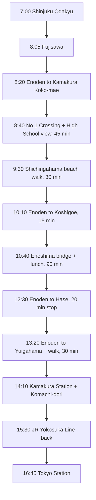

<em>Last updated: April 2026.</em>

<strong>Disclosure:</strong> This article contains affiliate links. We may earn a commission if you book through these links, at no extra cost to you.

*Kamakura Koko-mae No.1 Railroad Crossing — the exact frame from the 1993 Slam Dunk opening. Photo: Japan Pop Now.*

**One train every 12 minutes. One railroad crossing 100 meters west of Kamakura Koko-mae Station. Six named filming locations between Kamakura and Fujisawa, all reachable on a single Enoden 1-day pass (¥800).** I spent a Tuesday walking the full Slam Dunk route in January, caught the ocean-side Enoden pass at 7:42 AM with zero other photographers present, and was back at Shinjuku by 16:00. The 2022 film *The First Slam Dunk* — ¥16.2 billion at the Japanese box office and a worldwide hit in 2023-2024 — pushed the crowding here to a level that forced Kamakura City to post bilingual etiquette signs and station barriers in 2024. Most of those are still in place in 2026. This guide covers the exact spots, how to actually shoot them without annoying residents, current access rules, and a one-day route from Tokyo that skips the worst crowd windows.

<strong>The Kamakura Koko-mae No.1 Railroad Crossing (鎌倉高校前1号踏切, *Kamakura Kokomae ichi-go fumikiri*) is a public level crossing on the Enoshima Electric Railway ("Enoden" 江ノ電) line in Kamakura City, Kanagawa, located about 100 meters west of Kamakura Koko-mae Station with the Pacific Ocean and Enoshima island visible behind the tracks — the composition used in the opening sequence of the 1993-1996 TV anime adaptation of Takehiko Inoue's basketball manga *Slam Dunk* (スラムダンク).</strong>

| Detail | Info |
|--------|------|
| **Target Reader** | Anime fans on a Tokyo trip who want a half-day or full-day coastal pilgrimage |
| **Best Time to Visit** | Weekday mornings 7:00-9:00 AM, or January-February for thin crowds |
| **Budget** | About ¥4,500-6,000 per person including trains, Enoden day pass, and a Shonan lunch |
| **Must-Do** | Shoot the Enoden passing through the No.1 crossing with the ocean behind it |
| **English Support** | Enoden station signs bilingual. Kamakura Koko-mae has English etiquette signage. No English staff on site. |

<AffiliateCTA category="anime-pilgrimage" position="top" />

## Table of Contents

- Why the Kamakura Koko-mae crossing matters
- Current etiquette rules (2026) — read this before you go
- The 6 key Slam Dunk filming locations
- How to get from Tokyo to Kamakura Koko-mae
- One-day route: Shinjuku → Kamakura → Enoshima → back
- Best time of day and season for photos
- Why Japanese people love this spot
- Frequently Asked Questions

## Why Does the Kamakura Koko-mae Crossing Matter?

The shot is three seconds long. An Enoden train clears the crossing, Sakuragi Hanamichi is standing on the left, Akagi Haruko on the right, and the wave between them lands on the final frame before the *Slam Dunk* logo drops. That sequence opened the 1993 Toei Animation TV series and has been replayed for more than three decades — first on home video, then on streaming re-releases, and most recently in reaction clips tied to the 2022 film *The First Slam Dunk*, which director Takehiko Inoue wrote and supervised himself.

**The composition works because of three real geographic facts.** The Enoden tracks run east-west along a narrow shelf between the cliff (where Kamakura High School actually sits) and Shichirigahama beach. The No.1 crossing is the lowest one, so the horizon line of the Pacific drops directly behind any train passing through. Enoshima island sits on the western skyline, framing the shot. No other crossing on the 10 km Enoden line has this exact geometry.

*Seichi junrei* (聖地巡礼, "sacred site pilgrimage") visitors started arriving in the late 1990s, but the numbers exploded after *The First Slam Dunk* opened in Japan on December 3, 2022 and then in China, Korea, and Taiwan through 2023. Kamakura City reported that Chinese-language visitors to Kamakura Koko-mae Station more than doubled between 2022 and 2023 — peaking at a level the narrow residential road in front of the crossing was never designed to handle.

## What Are the Current Etiquette Rules (2026)?

<strong>Heads up:</strong> The No.1 crossing sits on a working residential road used by schoolchildren and delivery vans. Blocking it, even for "just one shot," is the single most-common complaint Kamakura City receives. Cars and bikes have priority. If staff or a resident asks you to move, move immediately.

Kamakura City and Kamakura High School have jointly posted bilingual (Japanese / English / Simplified Chinese / Traditional Chinese / Korean) signs at the crossing since 2023, and those signs are still in place in April 2026. The headline rules, translated and condensed:

1. **Do not stand in the road or the crossing itself.** Step onto the pedestrian side of the white line. The crossing bars drop every 12 minutes, and the Enoden does not stop for photographers.
2. **Do not enter Kamakura High School property.** The school gate is clearly marked. Shoot the building only from the public road outside.
3. **Keep voices low.** The houses on either side of the crossing are occupied. Early-morning visits (before 7:30 AM) are especially sensitive.
4. **No tripods, no drones, no flash.** Tripods block the narrow sidewalk; drones are illegal over the Enoden right-of-way; flash can disturb train drivers.
5. **Take your trash with you.** There are no bins at the crossing. The nearest convenience store is a 4-minute walk east back toward the station.

The city also deploys weekend and holiday staff at peak times — typically 10:00-16:00 on Saturdays, Sundays, and public holidays — with polite but firm instructions to keep the pedestrian flow moving. If you see them, assume the "no stopping in the road" rule is being actively enforced.

<strong>Pro tip:</strong> The best way to avoid the etiquette issue entirely is timing. Arrive between 6:45 and 8:15 AM on a weekday and you will often have the crossing to yourself. The Enoden starts running around 6:00 AM; the earliest westbound train with good morning light usually passes around 7:10 AM in winter and 6:40 AM in summer.

## What Are the 6 Key Slam Dunk Filming Locations?

The *Slam Dunk* pilgrimage is not just the one crossing. Inoue's backgrounds draw from a stretch of the Shonan coast between Kamakura and Fujisawa, all reachable on the Enoden line and all worth 15-30 minutes each. Here is the canonical list I use when I take first-time visitors.

| # | Location | Station | Scene reference | Visit time | Photo tip |
|---|----------|---------|-----------------|------------|-----------|
| 1 | **Kamakura Koko-mae No.1 Crossing** | Kamakura Koko-mae (鎌倉高校前) | OP wave scene | 30 min | South side of tracks, golden-hour westbound train |
| 2 | **Shichirigahama Beach** | Shichirigahama (七里ヶ浜) | Coastal cycling panels, manga volume covers | 30-45 min | Ocean-level shot with Enoshima on the horizon |
| 3 | **Kamakura High School building** | Kamakura Koko-mae | Ryonan High School visual model (view only) | 10 min | From public road outside the main gate, no entry |
| 4 | **Koshigoe area** | Koshigoe (腰越) | Back-alley and port backgrounds | 20 min | Narrow Enoden street-running section |
| 5 | **Yuigahama Beach** | Yuigahama (由比ヶ浜) | Beach training and run scenes | 20 min | Wide shot from the seawall promenade |
| 6 | **Hase Station area** | Hase (長谷) | Residential background plates | 15 min | Enoden pulling into a green-roofed station — classic frame |

The order you visit them depends on direction. If you come from Tokyo via JR to Kamakura Station, you ride Enoden westbound and hit them in the order Yuigahama → Hase → Koshigoe → Kamakura Koko-mae → Shichirigahama. If you come via Odakyu to Fujisawa, you ride eastbound and reverse that order. Most of my photographer friends prefer the Fujisawa entry because it lets you end the day at Kamakura Station for the faster JR route back to Tokyo.

### Why Shichirigahama Deserves Its Own Stop

Shichirigahama is the station after Kamakura Koko-mae heading west, and the beach here is one of the most-photographed stretches in Inoue's manga covers. The water is shallow and clear enough in winter that you can shoot the Enoden along the seawall with no people in frame. A 15-minute walk east along the beach path actually loops back to the No.1 crossing from below — which is how I shot the hero image for this article.

### Is the Kamakura High School Worth Visiting?

Only if you understand the rule first. The Kanagawa Prefectural Kamakura Senior High School (神奈川県立鎌倉高等学校) is the visual model for Ryonan High School (陵南高校), not Shohoku — a point most English-language blog posts still get wrong. Shohoku's exterior is based on Musashino Kita High School in Tokyo. You can see the Kamakura High building from the public road directly above the No.1 crossing; the gate is clearly signed and closed to visitors. Ten minutes on the road outside is enough.

<AffiliateCTA category="anime-pilgrimage" position="mid" />

## How Do You Get from Tokyo to Kamakura Koko-mae?

Two practical routes. Both take roughly the same total time; the difference is which station you want to be standing at when the day ends.

### Route A: JR via Kamakura (fastest from central Tokyo)

Tokyo Station → JR Yokosuka Line direct to Kamakura → transfer to Enoden westbound → Kamakura Koko-mae. Total time about 72-80 minutes, fare around ¥940 + ¥260 Enoden single. This is the route to use if you are staying in central Tokyo (Tokyo Station, Ginza, Roppongi) or want to visit the Great Buddha at Hase on the same trip.

### Route B: Odakyu via Fujisawa (cheapest, works from Shinjuku)

Shinjuku → Odakyu Enoshima Line to Fujisawa → transfer to Enoden eastbound → Kamakura Koko-mae. Total time about 90 minutes, but the Odakyu "Enoshima-Kamakura Free Pass" is ¥1,640 and includes a round-trip Shinjuku-Fujisawa plus unlimited Enoden rides the same day. If you are staying in Shinjuku or Shibuya and only want the Shonan coast (no Kamakura temples), Route B saves about ¥500-800 per person.

<strong>Pro tip:</strong> The Enoden 1-day pass (*Noriori-kun*, ¥800) is separate from the Odakyu Free Pass — you do not need both. If you buy the Odakyu Enoshima-Kamakura Free Pass at Shinjuku in the morning, your Enoden rides are already included, and you just hop on and off all day without ticket gates.

## One-Day Route: Shinjuku → Kamakura → Enoshima → Back

This is the route I give friends who only have one day. It starts early, hits all six filming spots, builds in a Shonan seafood lunch, and gets you back to Shinjuku before 17:00.

Text version of the same route: 7:00 depart Shinjuku on Odakyu, arrive Fujisawa 8:05, transfer Enoden and reach Kamakura Koko-mae by 8:20. Spend 45 minutes at the No.1 crossing (spot 1) and the high school view (spot 3). Walk 15 minutes east to Shichirigahama (spot 2), 30 minutes on the beach. Back on Enoden to Koshigoe (spot 4), 20 minutes. Walk 10 minutes to Enoshima bridge, take a 90-minute lunch on the island. Enoden back to Hase (spot 6), 20 minutes — this also gives you the option of a fast Great Buddha detour if time allows. Enoden to Yuigahama (spot 5), 30-minute beach walk. Enoden one stop to Kamakura Station, 15 minutes on Komachi-dori for snacks, then JR Yokosuka Line back to Tokyo Station by 16:45 or Shinjuku via transfer by 17:10.

Budget for the day: Odakyu Free Pass ¥1,640 + Enoshima lunch ¥1,800-2,500 + Komachi-dori snacks ¥800 + optional coffee stops ¥500 = roughly ¥5,000-5,500 per person, entirely cashless on Suica.

## When Is the Best Time of Day and Season for Photos?

**Weekday mornings, winter.** That is the short answer.

Light quality: the No.1 crossing faces roughly south, so the sun is behind you for most of the day. Winter sun (December-February) sits lower and gives you warmer tones closer to the anime palette. Golden hour in January runs roughly 15:30-16:30, but by then the weekend crowds are near peak. The better window is sunrise to 9:00 AM — cooler light, but empty frames.

Crowd levels by season, based on my own visits between 2023 and 2026:

- **January-February weekdays**: quietest. Often 0-3 other photographers on weekday mornings.
- **March-May**: spring break and Golden Week push weekend crowds to 80-150 people at the crossing. Weekday mornings still manageable.
- **June-September**: beach season. Coastal crowds are worse than pilgrimage crowds — Shichirigahama is packed, but the crossing itself stays busy only on weekends.
- **October-November**: second-best window. Clear weather, smaller crowds than spring.
- **Chinese New Year (late January / early February)**: worst week of the year. Skip entirely if you can.

Train schedule note: the Enoden runs every 12 minutes during daytime hours. The westbound train (toward Fujisawa, with the ocean on the right in your frame) is the one that matches the anime composition. Both directions pass within the same 12-minute cycle, so just wait one or two cycles for the one you want.

<strong>Background:</strong> Inoue Takehiko, the *Slam Dunk* author, grew up in Kagoshima but moved to Kanagawa Prefecture as an adult — his studio is in Yokohama. He has cited the Shonan coast specifically as the geography that anchored the original manga's sense of place, and the 2022 film *The First Slam Dunk* includes a direct homage shot of the No.1 crossing near the end of the film.

## Why Japanese People Love This Spot

*Slam Dunk* is the single most-read sports manga in Japan — over 170 million volumes printed since 1990. For Japanese fans in their 30s, 40s, and 50s, the Kamakura Koko-mae crossing is not just a backdrop; it is the visual that opened the anime every week during elementary school. Basketball club participation in Japan tripled in the years following the TV adaptation, and the 2022 film pulled that generation back into theaters with their own children.

The pilgrimage also fits a broader Japanese travel tradition: the Shonan coast has been a weekend day-trip destination for Tokyo residents since the Meiji era. The Enoden line itself is one of Japan's oldest surviving interurban railways (opened 1902) and is treated as a cultural landmark separately from any anime connection. When a Japanese family visits the No.1 crossing, they are doing two things at once — paying respect to a beloved manga and riding a heritage train line that has carried their grandparents to the beach.

This is also why the etiquette issue matters more here than at a typical anime pilgrimage spot. The residents living next to the crossing are not anime fans; they are locals who have watched the Enoden pass their living-room windows for 50 years. Keeping the pilgrimage low-impact is what keeps access open.

<AffiliateCTA category="anime-pilgrimage" position="end" />

## Frequently Asked Questions

**Q: Is the Kamakura Koko-mae crossing free to visit?**

Yes. It is a public level crossing on a city road. There is no admission fee, no reservation, and no closing time. The Enoden runs from roughly 5:45 AM to 23:30, and the crossing is physically accessible 24 hours. That said, the pedestrian rules and etiquette signs apply at all hours.

**Q: Can I actually enter Kamakura High School to see the Slam Dunk locations?**

No. The school is an active senior high school and closed to visitors. You can photograph the exterior building from the public road above the crossing, but do not attempt to enter the gate, climb the access stairs, or approach students. Note that the school is the visual model for Ryonan High School, not Shohoku — Shohoku is based on a different high school in Musashino, Tokyo.

**Q: How long does the full Slam Dunk pilgrimage take?**

About 4-5 hours on the ground if you visit all six locations on the Enoden line, plus 2.5-3 hours of travel from central Tokyo and back. A realistic one-day trip is 9-10 hours door-to-door from Shinjuku or Tokyo Station. If you only want the No.1 crossing and Shichirigahama, you can do it in a half-day (5-6 hours total).

**Q: Do I need the Enoden 1-day pass?**

If you are buying the Odakyu Enoshima-Kamakura Free Pass from Shinjuku, the Enoden is already included and you do not need a separate pass. If you come via JR from Tokyo or Yokohama, the Enoden 1-day pass (*Noriori-kun*) costs ¥800 and pays off after three Enoden rides — which you will easily hit if you visit more than two filming spots.

**Q: What is the etiquette for photographing the crossing?**

Stand on the pedestrian side of the white line, never in the road. No tripods, no flash, no drones. Keep voices low, take your trash with you, and if staff or residents ask you to move, move immediately. The rules are posted on bilingual signs at the crossing and have been enforced by Kamakura City staff on weekends since 2023.

**Q: Is the No.1 crossing wheelchair accessible?**

The crossing itself is a flat level crossing with paved pedestrian strips on both sides of the tracks, so the crossing section is accessible. However, Kamakura Koko-mae Station has a short staircase between the platform and street level, which can be a barrier. Shichirigahama Station, one stop west, is more accessible if you arrive from Fujisawa. Station accessibility can change year to year; confirm current access status on the [Enoden official station page](https://www.enoden.co.jp/) before your visit.

**Q: Can I combine the Slam Dunk pilgrimage with other Kamakura sights?**

Yes. The most common combination is the Great Buddha (Kotoku-in) at Hase Station, which is on the Enoden line between Kamakura and Koshigoe. Allow 45-60 minutes for the Great Buddha. Tsurugaoka Hachimangu shrine and Komachi-dori shopping street are both walking distance from Kamakura Station itself, adding another 60-90 minutes to your day.

## More Anime Pilgrimage Guides

Many anime pilgrimage spots sit a short train ride from Tokyo or Osaka. If you are building a multi-day itinerary, pair Kamakura with [Tokyo anime pilgrimage spots](/articles/anime-pilgrimage-spots-tokyo) for the Shinjuku and Shibuya angles, or plan around a [JR Pass anime pilgrimage route](/articles/jr-pass-anime-pilgrimage-routes-2026) if you are hitting three or more cities. For a full day trip menu, see [anime day trips from Tokyo](/articles/anime-day-trips-from-tokyo-2026), and for transport basics, the [Japan Rail Pass guide for anime fans](/articles/japan-rail-pass-guide-anime-fans) covers what actually works in 2026.

<strong>Follow <a href="https://www.threads.net/@pop_now_jp" rel="nofollow" target="_blank">@pop_now_jp on Threads</a></strong> for daily Japan pop culture updates and real-time pilgrimage photos from across the country.

