<em>Last updated: April 2026.</em>

<strong>Disclosure:</strong> This article contains affiliate links. We may earn a commission if you book through these links, at no extra cost to you.

*Dotonbori at dusk — Namba is the single densest square kilometer of anime collab cafes in Osaka, with four campaigns running within a 10-minute walk in April 2026*

**Twelve anime collaboration cafes are running or opening in Osaka between April and June 2026, concentrated in Namba (5), Shinsaibashi (2), Umeda (2), Tennoji (1), and Nihonbashi (2).** Demon Slayer's *Musunda En* at ufotable Cafe Osaka Namba (March 31 to May 6), Jujutsu Kaisen 5th-anniversary at Sweets Paradise Tennoji Mio (April 2 to 29), Blue Lock Honey & Lemon at Collabo Cafe Honpo Osaka Nihonbashi (April 15 to May 24), the Okami 20th-Anniversary Cafe at Monster Hunter Sakaba Namba (April 20 to June 1), and the Apothecary Diaries cafe at and GALLERY Namba 1 (April 4 to May 6) are the five most in-demand right now. I mapped all twelve on a single weekday loop in April — reservations, walk-ins, price ranges, and the traps English-speaking fans keep hitting at Osaka venues. Here is the honest guide you will not find on any English travel blog yet.

<strong>Osaka's anime collab cafe scene in 2026 runs on three distinct operator circuits — ufotable's in-house *Musunda En* lottery, Collabo Cafe Honpo's TableCheck first-come walk-ins in Nihonbashi and Namba, and retail-chain tie-ups like Sweets Paradise and SMILE BASE CAFE Shinsaibashi — with most campaigns lasting three to six weeks and requiring either a Japanese reservation system (*yoyaku*, 予約) or a coupon-driven seating fee (*chikenryo*, 着券料) of roughly ¥750 to ¥800 per guest.</strong>

| Detail | Info |
|--------|------|
| **Target Reader** | Anime fans with 1-2 days in Osaka who want multiple collab cafes in one trip |
| **Best Time to Visit** | Weekday mornings, doors at 10:00-11:00 — Saturday Namba is a meat grinder |
| **Budget** | Around ¥3,500 to ¥6,000 per cafe (food + drink + coupon + one merch roll) |
| **Must-Do** | Demon Slayer ufotable Namba — the only in-house IP cafe in Osaka and the hardest ticket |
| **English Support** | Menus Japanese-only at almost every venue; ufotable and Sweets Paradise apps are Japanese-first |

<a href="https://www.klook.com/en-US/activity/6441-osaka-amazing-pass/?aff_adid=REPLACE_WITH_KLOOK_AFF_ID" target="_blank" rel="nofollow"><strong>Quick booking: grab an Osaka Amazing Pass on Klook</strong></a> — it covers the Osaka Metro day-ticket plus 40+ attractions and makes the Umeda-Namba-Tennoji cafe loop in this guide effectively free on transit.

## Table of Contents

- Why Osaka is the second-biggest anime cafe city in Japan
- Comparison table: 12 Osaka anime cafes at a glance
- Top 3 right now (ranked)
- The rest of the venues
- 6-hour Umeda to Namba walking plan
- Reservation pitfalls foreign fans keep hitting
- Why Japanese people love this
- Frequently Asked Questions

## Why Osaka Is the Second-Biggest Anime Cafe City in Japan

Osaka runs roughly 60 to 80 percent of the collab cafe volume that Tokyo runs at any given time, with most IPs booking Tokyo plus one Kansai venue — and Osaka is almost always that Kansai venue. The operators concentrate in three districts: Namba (Collabo Cafe Honpo, and GALLERY, ufotable Cafe Osaka, Monster Hunter Sakaba), Shinsaibashi (SMILE BASE CAFE), and Tennoji (Sweets Paradise Tennoji Mio). Umeda anchors the merchandise side with Animate Umeda's nine-floor store and its stamp-rally drop-offs. *Kusuriya no Hitorigoto* (薬屋のひとりごと, The Apothecary Diaries), *Kimetsu no Yaiba* (鬼滅の刃, Demon Slayer), and *Blue Lock* (ブルーロック) are the three IPs running more than one Osaka venue simultaneously in April 2026 — the scene is deep enough to fill a full weekend without backtracking.

## Comparison Table — 12 Osaka Anime Cafes at a Glance

| Cafe | IP | Area | Dates | Reservation | Price | Verdict |
|------|----|------|-------|-------------|-------|---------|
| **ufotable Cafe Osaka Namba** | Demon Slayer *Musunda En* | Namba | Mar 31 – May 6 | Lottery (ufotable portal) | ¥800 coupon + menu | **Our Pick** — only in-house IP cafe in Osaka |
| **Sweets Paradise Tennoji Mio** | Jujutsu Kaisen 5th Anniv. | Tennoji | Apr 2 – Apr 29 | Required (SP app, 5-week window) | ¥1,650–¥3,000 | **Best Value** — all-you-can-eat buffet base |
| **Collabo Cafe Honpo Osaka Nihonbashi** | Blue Lock Honey & Lemon | Nihonbashi | Apr 15 – May 24 | First-come (TableCheck) | ¥800 food / ¥750 drink coupon | Walk-in friendly |
| **Monster Hunter Sakaba Namba** | Okami 20th Anniversary | Namba (Dotonbori) | Apr 20 – Jun 1 | Required (Pasela web) | ¥2,000–¥4,500 | Themed *izakaya* format |
| **and GALLERY Namba 1** | Apothecary Diaries | Namba | Apr 4 – May 6 | Optional (web or walk-in) | ¥850–¥3,000 | Easiest walk-in slot |
| **SMILE BASE CAFE Shinsaibashi** | Osomatsu-san 10th Anniv. | Shinsaibashi | Apr 11 – Apr 21 | Required (SMILE BASE web) | ¥800 coupon + menu | Short 11-day window |
| **Collabo Cafe Honpo Osaka Nihonbashi (Slot 2)** | Black Jack | Nihonbashi | Apr 10 – TBA | First-come (TableCheck) | ¥750–¥800 coupon | See operator site |
| **mixx garden Osaka Nihonbashi** | Dr.STONE | Nihonbashi | May 15 – Jun 14 | See operator site | See operator site | Opens late May |
| **Animate Cafe Stand Umeda** | Rotating IPs | Umeda | Rolling | Walk-in | ¥600–¥1,200 drinks | Drop-in between stamps |
| **Pokemon Cafe Osaka (Shinsaibashi)** | Pokemon | Shinsaibashi | Permanent | Required (Pokemon Cafe web, 31-day window) | ¥2,200–¥3,500 | Not IP-rotating |
| **Kirby Cafe Osaka** | Kirby (HAL / Nintendo) | Hankyu Umeda | Permanent | Required (EPARK) | ¥2,500–¥4,500 | Seasonal menu (check official) |
| **Sanrio Cafe Umeda** | Rotating Sanrio pop-ups | Umeda | Rolling | See operator site | See operator site | Dates rotate; check official |

<strong>Heads up:</strong> Prices quoted are the cafe's seating or coupon fee plus a representative menu item — your actual spend per person lands around <strong>¥3,500 to ¥6,000</strong> once you add a drink, one food plate, and a single merch roll. Budget ¥2,000 more if you want the random-draw *tokuten* (特典) coaster or acrylic stand.

<AffiliateCTA category="collab-cafes" position="mid" />

## Top 3 Right Now (Ranked)

### 1. Demon Slayer *Musunda En* at ufotable Cafe Osaka Namba — Our Pick

**March 31 to May 6, 2026.** The ufotable studio operates its own cafe network, so their *Kimetsu no Yaiba* (鬼滅の刃) collabs are always the highest production-value tier — hand-drawn character illustrations, bespoke tableware, and menu items you will not see at any chain collab. The 2026 *Musunda En* (結んだ縁, "Bonds Forged") campaign celebrates the Demon Slayer full-series rerun and runs simultaneously at ufotable's five venues: Tokyo Nakano, Nagoya, Osaka Namba, Tokushima, and Kitakyushu.

**Why Osaka Namba is the pick:** the venue sits at **3-3-3 Motomachi, Naniwa-ku**, a seven-minute walk from Namba Station, and the lottery slots cycle faster here than at the Tokyo Nakano flagship. Food runs around **¥1,400** per plate, drinks **¥900**, and every reservation guarantees one randomized tokuten coaster from the ten-variant pool.

**How to book:** ufotable runs a pure lottery *yoyaku* (予約) system on their portal at `ufotable.co.jp/cafe/reservation`. Entry opens exactly 30 days before your target date, and Osaka Namba slots for peak weekends (mid-April through Golden Week) close inside the first 20 minutes. Set a 12:00 JST alarm.

### 2. Jujutsu Kaisen 5th Anniversary at Sweets Paradise Tennoji Mio — Best Value

**April 2 to April 29, 2026.** *Jujutsu Kaisen* (呪術廻戦) returns to Sweets Paradise for its 5th anniversary run, and the Osaka leg lives at Sweets Paradise Tennoji Mio — a four-minute walk from JR Tennoji Station inside the Mio shopping complex. Sweets Paradise is a buffet chain, so your reservation fee includes a 70-minute all-you-can-eat run through their standard dessert and savory bar plus the limited JJK themed drinks and three collab menu plates.

The base buffet lands at around **¥1,650** per adult on weekdays and **¥1,980** on weekends, with a ¥500 JJK-anniversary surcharge that adds the themed menu and one randomized coaster. Compared to coupon-only cafes, you walk out full and with merch for under ¥2,500 — the best per-yen value of any Osaka cafe this month.

**Reservation:** the Sweets Paradise app opens bookings five weeks in advance. The Tennoji Mio venue does not take walk-ins during collab periods — without the app booking you will be turned away at the door.

### 3. Blue Lock Honey & Lemon at Collabo Cafe Honpo Osaka Nihonbashi

**April 15 to May 24, 2026.** The *Blue Lock* (ブルーロック) honey-and-lemon striker cafe runs in two phases — Phase 1 until roughly May 4, Phase 2 from May 5 onward — each with a different menu and a different five-variant coaster pool. The Osaka venue is **Collabo Cafe Honpo Osaka Nihonbashi**, at Nihonbashi-nishi 1-1-18, Naniwa-ku, a five-minute walk from Nippombashi Station Exit 5.

Pricing uses the standard Collabo Cafe Honpo model: **¥800 food coupon + ¥750 drink coupon** buys you seating for one 90-minute slot, then you order off the themed menu at the listed prices. Average per-person total lands around **¥3,800** with one food, one drink, and a single coaster bonus.

**Reservation:** Osaka Nihonbashi is first-come only via TableCheck — the Tokyo Akihabara venue runs an additional lottery but the Osaka store does not. That makes this the highest-IP cafe in Osaka you can realistically walk into at 14:00 on a weekday if the morning queue has cleared.

## The Rest of the Venues

### Okami 20th Anniversary Cafe at Monster Hunter Sakaba Namba

**April 20 to June 1, 2026.** Capcom's *Okami* (大神) hits its 20th anniversary and lands at Monster Hunter Sakaba's Osaka Namba branch — officially **Hunters Bar Osaka Namba**, at Dotonbori 1-4-27, inside Pasela Resorts Namba Dotonbori 4F. The format is themed *izakaya* dining: Amaterasu and Sakuya dishes plus an eight-variant coaster pool on drink orders. Reservation is required via the Pasela booking web (Japanese only), and the venue stays in standard Monster Hunter Sakaba mode during non-collab hours, so double-check you have booked the Okami collab slot specifically.

### Apothecary Diaries at and GALLERY Namba 1

**April 4 to May 6, 2026.** *Kusuriya no Hitorigoto* (薬屋のひとりごと, The Apothecary Diaries) runs a Namba-branch cafe at **and GALLERY Namba 1**, five minutes from Namba Station. Pricing sits at **¥850 to ¥3,000** per person and reservations are *optional* — walk-ins are taken when seats open, which makes this the most forgiving Osaka cafe for a tourist without Japanese-language booking confidence. We covered the full Apothecary Diaries *Oshi-Tabi* Shinkansen stamp rally in a [separate guide on the Osaka seven-spot loop](/articles/apothecary-diaries-oshi-tabi-osaka-shinkansen-2026).

### Osomatsu-san 10th Anniversary at SMILE BASE CAFE Shinsaibashi

**April 11 to April 21, 2026.** An 11-day burn, so plan early. The *Osomatsu-san* (おそ松さん) anniversary rolls through three SMILE BASE CAFE locations — Ikebukuro (April 4-20), Osaka Shinsaibashi (April 11-21), and Nagoya Sakae (May 1-11). The Osaka leg sits in Shinsaibashi's retail core, four minutes from Shinsaibashi Station, and the signature plate is the 10th Anniversary *Aiaigasa* (相合傘) Love Omurice. Reservation required via SMILE BASE CAFE's official web portal.

### Black Jack at Collabo Cafe Honpo Osaka Nihonbashi

**Running from April 10, 2026 (end date TBA).** Tezuka Osamu's *Black Jack* runs a concurrent slot at Collabo Cafe Honpo's Osaka Nihonbashi branch alongside the Blue Lock campaign — the two cafes share the venue across different time slots. Confirm current menu and closing date via the [Collabo Cafe Honpo event page](https://collabocafe-honpo.co.jp/) before visiting.

### Dr.STONE at mixx garden Osaka Nihonbashi

**May 15 to June 14, 2026.** Dr.STONE's themed picnic cafe launches in mid-May at mixx garden's Osaka Nihonbashi location, twinned with the Ikebukuro venue. Character-inspired dishes plus exclusive illustration cards. Bookmark if your Osaka trip falls late May or early June — reservation method and pricing are announced on the [mixx garden official page](https://mixxgarden.jp/) closer to launch.

### Animate Cafe Stand Umeda

Rolling. Animate Umeda's cafe stand rotates IPs every two to four weeks with drip drinks (**¥600-800**), character lattes (**¥1,000-1,200**), and themed coaster bonuses. Walk-in only, no reservation. This is the right drop-in between stamp rally spots — a 15-minute visit that costs under ¥1,500 and still hands you a coaster. Always check `cafe.animate.co.jp/schedule` the morning of your Umeda day for the current IP.

### Pokemon Cafe Osaka Shinsaibashi

Permanent fixture, not a rotating collab cafe — but worth the detour if you have a Pokemon fan in the party. Reservations open 31 days in advance on the Pokemon Cafe official web portal and for weekends close within roughly five minutes of the 18:00 JST release. Pricing runs **¥2,200** for the character plate lunch and **¥3,500** for the full course.

### Kirby Cafe Osaka (Hankyu Umeda)

Permanent, themed Kirby and HAL Laboratory restaurant inside the Hankyu Umeda complex. As of April 2026, the venue runs its *Chef Kawasaki Spring* seasonal menu at ¥2,500 to ¥4,500 per person, with EPARK reservation required. Menu rotates seasonally — confirm the current lineup on the [Kirby Cafe official site](https://kirbycafe.jp/) before booking.

<strong>Pro tip:</strong> If your Osaka day is a Saturday or a public holiday, flip the order — start at <strong>ufotable Cafe Osaka Namba</strong> if you won the lottery, then hit the two Collabo Cafe Honpo slots in Nihonbashi for afternoon walk-ins when the morning Tokyo day-trippers have cleared out by 14:30.

## 6-Hour Umeda to Namba Walking Plan

```mermaid
graph LR
    A[10:00 Umeda — Animate Cafe Stand] --> B[10:45 Midosuji Line to Shinsaibashi]
    B --> C[11:30 SMILE BASE CAFE Shinsaibashi — Osomatsu-san]
    C --> D[13:00 Walk 10 min south]
    D --> E[13:15 and GALLERY Namba 1 — Apothecary Diaries walk-in]
    E --> F[14:30 Walk 6 min]
    F --> G[14:45 Collabo Cafe Honpo Nihonbashi — Blue Lock]
    G --> H[16:00 Walk to Namba Station]
    H --> I[16:15 ufotable Cafe Osaka Namba — Demon Slayer]
```

**Text version of the plan:** Start at Animate Cafe Stand Umeda at 10:00 for a quick themed drink and one stamp. Take the Midosuji Subway Line three stops south to Shinsaibashi (4 minutes, ¥240). Hit SMILE BASE CAFE Shinsaibashi at 11:30 for the Osomatsu-san lunch slot (reservation required in advance). Walk 10 minutes south through Shinsaibashi-suji shopping arcade to Namba and reach and GALLERY Namba 1 by 13:15 — try an Apothecary Diaries walk-in. Six-minute walk east to Collabo Cafe Honpo Osaka Nihonbashi for Blue Lock at 14:45 (TableCheck first-come). Finish at ufotable Cafe Osaka Namba at 16:15 for Demon Slayer *Musunda En* (only if you won the lottery). Dinner in Dotonbori after.

Total walking: around 3.8 km. Total transit cost: under **¥500** if you bought the Osaka Amazing Pass. Total cafe spend: **¥16,000 to ¥22,000** per person for the full loop.

## Reservation Pitfalls Foreign Fans Keep Hitting

**Mistake 1: Trying to reserve from outside Japan.** Sweets Paradise and SMILE BASE CAFE apps require an SMS verification to a Japanese mobile number. If you are not in Japan yet, ask a friend already here to book on your behalf, or arrive in Osaka two days before the cafe date and book from your hotel WiFi on an eSIM-connected phone.

**Mistake 2: Assuming "reservation" means "ticketed entry".** At Collabo Cafe Honpo and mixx garden, a "reservation" via TableCheck is *jiyu seki* (自由席, free seating) — you still pay the ¥750 to ¥800 coupon at the door. There is no pre-payment. First-come within the reservation window.

**Mistake 3: Walking into a lottery-only venue.** ufotable Cafe Osaka Namba does not accept walk-ins during collab periods. If you didn't win the lottery, the closest substitute is the Demon Slayer-themed merch corner at Animate Umeda — a consolation stamp, not the experience.

**Mistake 4: Missing the coaster reroll rule.** At most Osaka cafes, the random-draw tokuten coaster is **one per order**, not one per person. Groups of 2+ should order one drink each and then a shared food plate to triple the coaster draws for the same total spend.

**Mistake 5: Showing up in the wrong Nihonbashi.** Osaka has two Nihonbashi stations — **Nippombashi (近鉄・地下鉄)** for Collabo Cafe Honpo and mixx garden, and **Shin-Nipponbashi** is a different line and a 15-minute walk off. Exit at Nippombashi Exit 5, not 9, and double-check the reading — Osaka's 日本橋 is *Nippombashi*, not Tokyo's *Nihonbashi*.

## Why Japanese People Love This

Osaka's collab cafe density is a side-effect of the city's deep otaku retail corridor — Den Den Town in Nihonbashi is the Kansai equivalent of Akihabara, and the blocks around Namba have hosted anime shops continuously since the 1980s *Gundam* boom. For Osaka fans, hitting a collab cafe in Nihonbashi is less a destination trip than a Saturday habit — the route from Animate Umeda to Collabo Cafe Honpo to Jungle toy store is a well-worn weekend loop. The *chikenryo* (着券料, coupon fee) model feels normal to locals because it mirrors the pattern of *maid cafes* and kabuki-za *obento* bundles: you are paying for the space and the themed object, not the food. Overseas fans tend to read the coupon as a cover charge and balk — once you reframe it as "the cost of the limited coaster plus a seat to enjoy it," the economics click.

## FAQ: Frequently Asked Questions

**Q: Do I need a Japanese phone number to book Osaka collab cafes?**

Most do, yes. Sweets Paradise, SMILE BASE CAFE, and Pokemon Cafe all require Japanese SMS verification. Collabo Cafe Honpo uses TableCheck, which accepts international phone numbers with country code, and and GALLERY Namba 1 lets you walk in without any reservation. If you are reading this before your trip, plan around the walk-in and TableCheck venues — they cover five of the twelve cafes in this guide.

**Q: Can I visit all 12 Osaka anime cafes in one day?**

No. The realistic single-day cap is four to five venues, limited by 60 to 90-minute seating slots and the two to three stops you need between them. The 6-hour Umeda-to-Namba plan above targets five. For the full twelve, plan a Friday-Saturday-Sunday trip and batch by district: Umeda Friday evening, Namba + Nihonbashi all Saturday, Shinsaibashi + Tennoji Sunday.

**Q: What is the difference between *yoyaku* and *chikenryo* at Osaka cafes?**

*Yoyaku* (予約) is the reservation — your seat and time slot. *Chikenryo* (着券料, literally "seat-ticket fee") is the coupon you pay at the door for access to the themed menu and the random tokuten (特典, bonus) coaster. A TableCheck reservation is free, but without paying the ¥750 to ¥800 chikenryo at arrival, you cannot order off the collab menu. Budget both.

**Q: Are any of the Osaka anime cafes in English?**

None of the collab cafes offer English menus. The permanent fixtures — Pokemon Cafe Osaka Shinsaibashi and Kirby Cafe Osaka Hankyu Umeda — have English-speaking staff and picture menus, so they are the safest bet if your group has zero Japanese. For the rotating IP cafes, either screenshot the Japanese menu and run it through Google Translate at the table, or book through Klook when a specific collab has English-language booking support (rare, but Blue Lock and Jujutsu Kaisen have appeared on Klook in past runs).

**Q: How far in advance should I book the ufotable Demon Slayer cafe?**

Exactly 30 days before your target date, at 12:00 JST sharp. Weekend slots for Osaka Namba close inside 15 to 25 minutes of the lottery opening. Weekday slots — particularly Tuesday through Thursday 14:00 to 16:30 — remain available into the last 10 days before the date. If you are flexible on day, aim for mid-afternoon Wednesday and your lottery odds are roughly 3x better than a Saturday noon.

**Q: Do any Osaka collab cafes ship merchandise overseas?**

No. Cafe-exclusive merchandise is cafe-pickup only — you have to be physically at the venue during the campaign to receive the random-draw coaster or acrylic stand. For non-cafe-exclusive merchandise, the **Animate Umeda flagship** (9 floors) carries the same IP's general collab goods and ships internationally via proxy services like Tenso or FromJapan — ask at the ground-floor information desk for the proxy shipping form.

## More Collab Cafe Guides

- [Apothecary Diaries Oshi-Tabi Osaka Shinkansen Guide 2026](/articles/apothecary-diaries-oshi-tabi-osaka-shinkansen-2026)
- [Rilakkuma Cafe Tokyo and Osaka 2026 Guide](/articles/rilakkuma-cafe-tokyo-osaka-2026)
- [Pokemon Karaoke Manekineko 30th Anniversary Guide](/articles/pokemon-karaoke-manekineko-30th-anniversary-2026)
- [Krispy Kreme x Super Mario Galaxy Shibuya 2026](/articles/krispy-kreme-mario-galaxy-shibuya-2026)
- [Akihabara Arcade Rhythm Games Guide 2026](/articles/akihabara-arcade-rhythm-games-guide-2026)

<AffiliateCTA category="collab-cafes" position="end" />

<strong>Follow <a href="https://www.threads.net/@pop_now_jp" rel="nofollow" target="_blank">@pop_now_jp on Threads</a></strong> for daily Osaka and Tokyo anime cafe updates.

