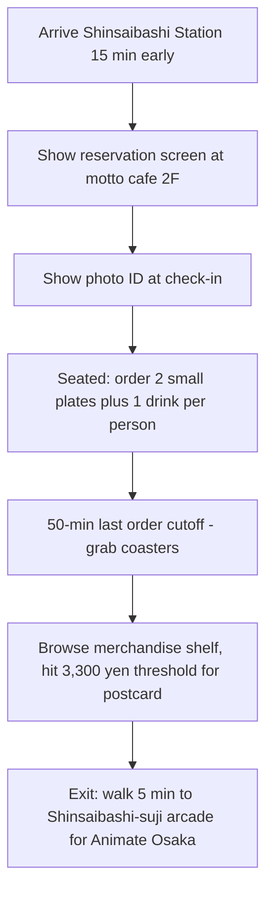

<em>Last updated: April 21, 2026. Venues, dates, and reservation rules re-checked against the Hakusensha Cafe official page, Tree Village announcements, and the @ourancafe X account on the same day.</em>

<strong>Disclosure:</strong> This article contains affiliate links. We may earn a commission if you book through these links, at no extra cost to you.

*Photo: Kakidai / [Wikimedia Commons](https://commons.wikimedia.org/wiki/File:Tokyo_Skytree_%26_East_Tower.jpg), CC BY-SA 4.0. Tokyo Skytree and East Tower — the Solamachi complex hosting the Tree Village Tokyo venue for the Ouran 20th Anniversary cafe run, active through May 1, 2026.*

**The Ouran High School Host Club (桜蘭高校ホスト部) 20th Anniversary Collaboration Cafes open in three different operators and five different venues across 2026: the Hakusensha Collaboration Cafe "2nd" series moves from its Ikebukuro leg (January to March) to motto cafe 大阪店 in Shinsaibashi on April 22, running through July 5 in two menu periods; Tree Village Tokyo Skytree Solamachi is running its 20th Anniversary LaLa tie-in cafe through May 1; and Tree Village Osaka and Hakata pick up the same 20th Anniversary concept from May 23 to June 4.** The third concurrent run is at motto cafe 池袋店 through May 17. Reservations for every cafe use the Collabo Cafe Tokyo app or website, with a ¥330 (tax included) reservation fee per seat at the motto cafe venues, and order-based coaster and postcard giveaways at the Tree Village venues.

For overseas fans who came in through the BONES 2006 anime, Ouran remains one of the best-built shojo host-club comedies Japan has exported. If you are planning a spring 2026 trip to Tokyo, Osaka or Hakata, or you are already in Japan during Golden Week, one of these three cafes is within a 10-minute walk of a station you were going to pass through anyway — and the 20th Anniversary merchandise has new illustrations drawn by Bisco Hatori (葉鳥ビスコ) that have not appeared at any previous Ouran cafe.

<strong>The Ouran High School Host Club 20th Anniversary (桜蘭高校ホスト部20周年) is a 2026 Hakusensha, LaLa magazine 50th Anniversary and BONES TV anime anniversary project commemorating 20 years since the 2006 NTV anime broadcast. Three concurrent collaboration cafes run in parallel: the Hakusensha Cafe "2nd" series at motto cafe Osaka (Apr 22 to Jul 5), Tree Village Tokyo Skytree Solamachi (through May 1), Tree Village Osaka and Hakata (May 23 to Jun 4), and motto cafe Ikebukuro (through May 17). Reservations are through the Collabo Cafe Tokyo platform.</strong>

<a href="https://www.klook.com/en-US/activity/122333-jr-pass-japan/?aff_id=1251547&aff_label=ouran-20th-anniversary-2026-top" target="_blank" rel="nofollow nofollow sponsored"><strong>Quick booking: lock in your JR Pass on Klook</strong></a> — chaining Tokyo Solamachi → motto cafe Osaka Shinsaibashi on one trip costs less with the 7-day pass than two separate shinkansen legs, and the Tokyo cafe closes 10 days before the Hakata leg opens, so the timing rewards a pass holder.

## Quick start
| Detail | Info |
|--------|------|
| Target reader | Shojo, BL-adjacent and BONES anime fans visiting Japan between April 22 and July 5, 2026 |
| Best time to visit | Weekday afternoons on a reservation slot — motto cafe walk-ins are rarely possible during the opening two weeks |
| Budget | **¥2,000 to ¥4,500** per person including reservation fee, one-order minimum and one random coaster |
| Must-do | Book the motto cafe Osaka opening week (Apr 22 to 29) to secure the 20th Anniversary illustration merch before stock rotation |
| English support | Collabo Cafe Tokyo reservation site has no English version; staff at motto cafe can process a printed reservation screen |
| Languages on menu | Japanese only — we translate the character-drink code below |

## The Three 2026 Cafe Runs at a Glance

| Run | Venue | Dates | Style | Reservation |
|-----|-------|-------|-------|-------------|
| Hakusensha Cafe "2nd" — Ikebukuro | motto cafe 池袋店 (Higashi-Ikebukuro) | **Jan 8 – Mar 15, 2026 (closed)** | Character drink + birthstone menu, full set of 7 hosts | Closed |
| Hakusensha Cafe "2nd" — Osaka | motto cafe 大阪店 (Shinsaibashi) | **Apr 22 – Jul 5, 2026** | Two menu periods (Front Apr 22–May 28, Back May 29–Jul 5) | Collabo Cafe Tokyo app, ¥330 tax incl |
| motto cafe Ikebukuro (LaLa 50th tie-in) | motto cafe 池袋店 | **Mar 6 – May 17, 2026** | Separate LaLa-50 theme run, parallel to the Hakusensha Cafe | Collabo Cafe Tokyo app, ¥330 tax incl |
| Tree Village 20th — Tokyo | Tokyo Skytree Town Solamachi West Yard 4F | **Apr 1 – May 1, 2026** | 20th Anniversary "Colorful Heart" mini-character theme | Walk-in + reservation mix at Tree Village Cafe |
| Tree Village 20th — Osaka + Hakata | TBD within Tree Village store network | **May 23 – Jun 4, 2026** | Same "Colorful Heart" concept, shorter 13-day run | Announced closer to open date |

Three different operators (Hakusensha Cafe / motto cafe Ikebukuro LaLa 50 / Tree Village) are all calling their 2026 projects "20th Anniversary" — this guide treats them as one Ouran universe so you can pick one or combine two without paying for a visit that duplicates your menu experience.

## What Is the 20th Anniversary Actually Celebrating?

Bisco Hatori's Ouran High School Host Club manga was serialized in Hakusensha's LaLa magazine from September 2002 to November 2010, spanning 18 volumes with an official tally at 14 million copies in circulation. The **TV anime by BONES aired April 5 to September 26, 2006, on NTV**, which makes 2026 the 20th broadcast anniversary year.

Three things happen around this milestone simultaneously. First, Hakusensha commissioned a new Ouran 20th commemorative illustration by Bisco Hatori, which debuts on the Hakusensha Cafe "2nd" merchandise. Second, LaLa magazine itself is celebrating its 50th anniversary (the magazine launched 1976), and the motto cafe Ikebukuro run and the Tree Village "Colorful Heart" cafe series are both part of that LaLa 50-year arc. Third, Animate ran a January 24 to February 15 anniversary commemorative fair at stores nationwide, and the overall @ouran_20th official account has been teasing additional 2026 projects for later in the year.

<strong>Why it matters for fans:</strong> This is the first time since the original 2006 anime that Ouran has had simultaneous merchandise, cafe, exhibition and pop-up runs at three separate operators in the same quarter. The Hakusensha Cafe 20th Anniversary illustration is a new Bisco Hatori piece commissioned for the "2nd" series; the Animate January to February commemorative fair used a separate Kumiko Takahashi character-designer illustration. Each venue's merchandise reuses its own operator's art rather than sharing a single image.

## Where and When Can I Actually Go? (April 21 status)

*Photo: Dick Thomas Johnson / [Wikimedia Commons](https://commons.wikimedia.org/wiki/File:Animate_Ikebukuro_20120613_1.jpg), CC BY 2.0.*

**Tree Village Tokyo Skytree Solamachi closes in 10 days (May 1)**, and it is the only Tokyo venue currently open on the 20th Anniversary side. If you are landing in Tokyo before May 1, this is the urgent one.

**motto cafe 大阪店 opens tomorrow (April 22)** — reservations are already live through the Collabo Cafe Tokyo app. Opening-week slots are the most competitive; aim for Monday to Thursday to increase your hit rate.

**motto cafe 池袋店 is active through May 17** on a parallel LaLa 50th Anniversary Ouran run with a different menu from the Osaka "2nd" leg. If you miss Solamachi, Ikebukuro is the Tokyo backup through mid-May.

| Status today (Apr 21) | Venue | Your move |
|----------------------|-------|-----------|
| **Opens tomorrow** | motto cafe 大阪店 | Book Apr 22-29 slot via Collabo Cafe Tokyo |
| **Active, 10 days left** | Tree Village Tokyo Solamachi | Walk-in before May 1 |
| **Active, 26 days left (check for late-Apr to early-May closure window)** | motto cafe 池袋店 | Book on Collabo Cafe Tokyo for May dates; confirm availability for your date before travel |
| **Opens May 23** | Tree Village Osaka + Hakata | Monitor @ourancafe for venue confirmation |

## Ouran Character Ranking for Menu Strategy

The cafe menu is organized around the Host Club members. Order based on which character matches your flavor priority, not which one you shipped hardest in 2006.

| Rank | Character | What to order | Price (Ikebukuro ref.) |
|------|-----------|---------------|------------------------|
| 1 | **Haruhi Fujioka** | Haruhi's *gotta-ni* Hotpot Set (ごった煮定食) — the set meal the commoner-scholarship lead actually eats in the manga | ¥1,650 tax incl |
| 2 | **Kyoya Ootori** | Kyoya's Spicy Chicken (辛みチキン) — dark, dry, high-contrast plating on black ceramic | ¥1,210 tax incl |
| 3 | **Honey-senpai** | Mini Cake Assortment (ミニミニケーキ盛り合わせ) — the most photogenic single plate, six small slices | ¥1,430 tax incl |
| 4 | **Tamaki Suoh** | Rose-motif sweets plate (blond-prince theme) — check the menu PDF for confirmed price on opening day |
| 5 | **Hikaru + Kaoru Hitachiin** | Twin-colored paired drinks designed to be photographed side by side |
| 6 | **Mori-senpai** | Black coffee + cake simple-plate combo, mirror of his low-speech screentime |

Prices above are carried over from the motto cafe Ikebukuro January to March 2026 run, which used the Hakusensha Cafe "1st" menu. The Osaka "2nd" menu is expected to mirror the pricing structure with new 20th Anniversary plating, and the Tree Village menu at Tokyo Skytree uses its own pricing published on the official Tree Village Cafe page closer to each venue opening date. **All prices should be re-checked at the front counter before ordering.**

## The Loot: Coasters, Postcards and the 20th Illustration

Every 2026 Ouran cafe in the trio uses a similar mechanic — order from the menu, receive random coaster; buy merchandise above a ¥3,300 threshold, receive random postcard.

| Venue | Order perk | Merchandise perk |
|-------|-----------|------------------|
| Hakusensha Cafe Osaka (motto cafe) | **1 of 7 original coasters** (random) per menu item ordered | 1 of 7 original postcards (random) per ¥3,300 tax incl purchase |
| motto cafe Ikebukuro (LaLa 50) | **1 of 7 original coasters** (random) per menu item ordered | 1 of 7 original postcards (random) per ¥3,300 tax incl purchase |
| Tree Village Tokyo Solamachi | **1 of 7 original coasters** (random) per menu item ordered | 1 of 7 original postcards (random) per ¥3,300 tax incl purchase |
| Tree Village Osaka + Hakata (May 23–Jun 4) | Announced closer to opening — expected to match Tokyo leg | Expected to match Tokyo leg |

**The 20th Anniversary illustration** is the single piece of new Bisco Hatori art commissioned for 2026 and appears on merchandise at every venue. The TR sticker collection (7 types) launched January 2026 via mu-mo Shop uses it, as does the 20th Commemorative Fair merchandise that Animate ran through February 15. If you miss every cafe, the sticker collection on mu-mo Shop is the backup to own the illustration.

<strong>Pro tip:</strong> At motto cafe venues, order three small single plates rather than one combo to chase the 7 coaster variants. Each menu item triggers one coaster draw. Average ¥600–¥900 per small plate is lower total spend than a ¥1,650 combo for the same number of draws.

## A One-Hour Plan for motto cafe Osaka (April 22 Opening Week)

*Photo: そらみみ / [Wikimedia Commons](https://commons.wikimedia.org/wiki/File:View_of_Shinsaibashi-suji_Shopping_Street_from_Ebisubashi_Bridge.jpg), CC BY-SA 4.0.*

For a solo traveler or a pair, here is the most efficient first-visit loop.

**Expected outcome:** Two coasters per person from the 7-variant pool (a ~58% chance of at least one duplicate pair for a two-person booking), one postcard per group if you spent ¥3,300 or more on merchandise, and your seat's character-themed plating photographed in about 50 minutes of total cafe time. Total spend per person lands around **¥2,800 to ¥4,500** depending on if you upgrade to a full main dish.

## How Do I Actually Book From Overseas?

Collabo Cafe Tokyo (collabocafe.tokyo) is Japanese-only and requires a mobile phone verification for the first booking. Three paths work.

**Path 1: If you have a Japanese phone number or an eSIM with SMS receive.** Sign up at app.collabocafe.tokyo, verify SMS, book the slot, pay the ¥330 reservation fee by credit card, and show the reservation screen at check-in along with a passport.

**Path 2: If you do not have a Japanese SMS channel.** Ask your hotel concierge to book for you. Major Osaka hotels (Cross Hotel Osaka, Swissotel Nankai, Hotel Monterey Grasmere) are familiar with the platform. Tip about ¥500 for the assistance.

**Path 3: Tree Village venues as the no-reservation backup.** Tree Village Tokyo Solamachi and the May Osaka and Hakata runs handle seating differently — you can often walk in on weekdays and be seated within 15 to 30 minutes. This is the route I recommend for first-timers with no Japanese.

<a href="https://www.klook.com/en-US/activity/122333-jr-pass-japan/?aff_id=1251547&aff_label=ouran-20th-anniversary-2026-bottom" target="_blank" rel="nofollow nofollow sponsored"><strong>Check JR Pass prices on Klook</strong></a> — the Shinsaibashi (Osaka) plus Solamachi (Tokyo) plus Hakata (Fukuoka) triangle is exactly what the pass is priced for, and all three Ouran venues are covered by the 7-day ordinary pass inside the Apr 22 to Jul 5 window.

## What makes this attraction stand out

*Photo: Hirho / [Wikimedia Commons](https://commons.wikimedia.org/wiki/File:Fukuoka_Center_Bldg_the_Sunplaza_and_Hakata_Station_West_12b_exit_Hakata-ekimae_2-ch%C5%8Dme_Hakata-ku_Fukuka_20250624.jpg), CC BY-SA 4.0.*

Ouran is uncommon among shojo properties in that its Japanese fan base has aged with the show rather than turning over. Fans who were in middle school during the 2006 NTV broadcast are now in their mid-thirties, have disposable income, and treat the 20th Anniversary merchandise as a permission slip to buy the acrylic stand they would not have spent ¥2,200 on at 16. This is why Hakusensha has run three full-scale cafe collaborations in 2022, 2024 and 2026 — the 2024 original Ikebukuro "My Charaful Cafe" run sold through its merchandise stock in the first week, and the 2026 Ikebukuro leg (January to March) reportedly hit its booking cap on opening day. The Osaka leg is expected to do the same.

For international readers, Ouran is also the anime that taught a generation what *ikemen* means without having to translate the word. The 2006 Funimation English dub remains in print; a Hulu U.S. stream is active for the full 26 episodes; the live-action 2011 TV drama and the 2012 live-action film are on the JP Netflix and Amazon Prime back catalog. This is a low-friction rewatch before your cafe visit.

## Is This a Good Trip for Solo Travelers or Groups?

For solo travelers, the Hakusensha Cafe Osaka opening week is the highest-reward visit — single-seat reservations are available, the character plate photography is set up for solo angles, and you can hit the ¥3,300 merchandise threshold with two acrylic stands or a single tote bag. Expect **¥3,000 to ¥4,500** per person all-in.

For a pair or a group of three, the Tree Village Tokyo Solamachi walk-in is the easier option through May 1 — no reservation pressure, no Japanese SMS requirement, and Solamachi is already a Skytree tourist stop so the cafe doubles as your lunch. The trade-off is menu variety; Tree Village runs a shorter list than the Hakusensha Cafe.

Shojo fans can chain this with the [Apothecary Diaries Oshi-tabi Osaka shinkansen guide](/articles/apothecary-diaries-oshi-tabi-osaka-shinkansen-2026) for a Kansai pop-up itinerary, or stay in Tokyo and combine the Solamachi leg with the [Krispy Kreme Mario Galaxy Shibuya](/articles/krispy-kreme-mario-galaxy-shibuya-2026) collab for a Tokyo pop-up weekend.

## FAQ: Ouran Host Club 20th Anniversary Cafes

**Q: Do I need to speak Japanese to visit the motto cafe Osaka Ouran run?**

Reading Japanese is not required on-site — the menu is visual enough that pointing works, and the 2F motto cafe Osaka (Shinsaibashi) staff have handled non-Japanese-speaking reservation holders for past collaborations. The Collabo Cafe Tokyo booking platform itself is Japanese-only. If you do not read Japanese, the two workarounds are (a) ask a hotel concierge to book, or (b) skip motto cafe Osaka and visit Tree Village Tokyo Solamachi on walk-in through May 1.

**Q: How much does a 60-minute visit actually cost?**

Expect per-person costs of **¥1,650 to ¥2,800** on the food and drink order (one main plate plus one drink), plus **¥330** for the reservation fee at motto cafe venues, plus merchandise if you want the 7-variant postcard drop (¥3,300 tax incl minimum). A budget-minimum solo visit is ¥1,980 (one drink plus reservation fee) if you only want a coaster and the experience. A merchandise-maximizer visit is around **¥6,000 to ¥8,000**.

**Q: Can I walk in without a reservation?**

At motto cafe Osaka: almost never during opening weeks. From late May onward, weekday walk-ins may work but are not promised. At motto cafe Ikebukuro: occasional weekday walk-ins have been reported in March to April. At Tree Village Tokyo Solamachi: walk-ins are normal, with 15 to 30 minute waits during peak GW and weekends.

**Q: Which cafe has the rarest merchandise?**

The Hakusensha Cafe "2nd" Osaka run is the only 2026 cafe venue selling the full Ouran 20th commemorative merchandise series. The Tree Village Tokyo and Osaka and Hakata runs sell a smaller LaLa 50-themed sub-set. motto cafe Ikebukuro ran an overlap but with a 1st-menu coaster set already distributed in January to March.

**Q: Is there an Ouran exhibition or pop-up I should also visit?**

The Animate 20th Anniversary Commemorative Fair ran January 24 to February 15 nationwide and is closed. The mu-mo Shop Ouran 20th TR Sticker Collection (7 types) is still live for online order and ships internationally via proxy. Monitor the @ouran_20th official X account for later-2026 pop-up announcements.

**Q: Will the May 23 to June 4 Tree Village Osaka and Hakata venues take bookings before opening?**

As of April 21, the Tree Village Osaka and Hakata specific store locations and any reservation mechanism have not been announced. The Tokyo Solamachi leg has been walk-in with limited timed-entry reservation windows during peak weekends; the Osaka and Hakata legs are expected to follow the same pattern. Check tree-village.jp/news closer to May 20.

## Sources

- [Hakusensha Collaboration Cafe "2nd" official site (Japanese)](https://ouran-2nd.hakusensha-cafe.com/) — menu overview, Osaka dates April 22 to July 5, two menu periods
- [Hakusensha Cafe "2nd" Osaka venue page (Japanese)](https://ouran-2nd.hakusensha-cafe.com/osaka/) — motto cafe 大阪店 venue, reservation rules
- [collabo-cafe.com TreeVillage 2026 brief (Japanese)](https://collabo-cafe.com/events/collabo/ouran-high-school-host-club-cafe-tree-village-2026/) — Tokyo Apr 1 to May 1, Osaka Hakata May 23 to Jun 4, coaster and postcard giveaway rules
- [tree-village.jp 20th Anniversary announcement (Japanese)](https://tree-village.jp/news/014440.html) — Solamachi West Yard 4F location, 10:00 to 21:00 cafe hours, Bisco Hatori illustration
- [collabo-cafe.com motto cafe Ikebukuro LaLa 50 brief (Japanese)](https://collabo-cafe.com/events/collabo/ouran-high-school-host-club-cafe-mottocafe-ikebukuro-2026/) — Ikebukuro Mar 6 to May 17, ¥330 reservation fee tax incl
- [Nijimen Ouran 20th cafe coverage (Japanese)](https://nijimen.kusuguru.co.jp/topics/600490) — 20th Anniversary "Colorful Heart" mini-character illustration details
- [@ourancafe official X](https://x.com/ourancafe) — real-time menu reveals and reservation status updates

## More Pop-Culture Guides

- [Pokemon Karaoke Manekineko 30th Anniversary 2026 Guide](/articles/pokemon-karaoke-manekineko-30th-anniversary-2026)
- [Rilakkuma Cafe Tokyo Osaka 2026: Shibuya 109 Booking and Menu Guide](/articles/rilakkuma-cafe-tokyo-osaka-2026)
- [Apothecary Diaries Oshi-Tabi Osaka Shinkansen 2026 Guide](/articles/apothecary-diaries-oshi-tabi-osaka-shinkansen-2026)
- [Demon Slayer ufotable Rerun Cafe 2026: Tokyo and Osaka Guide](/articles/demon-slayer-rerun-cafe-ufotable-kizuna-2026)
- [Krispy Kreme Mario Galaxy Shibuya 2026](/articles/krispy-kreme-mario-galaxy-shibuya-2026)

<strong>Follow <a href="https://www.threads.net/@pop_now_jp" rel="nofollow" target="_blank">@pop_now_jp on Threads</a></strong> for daily Japan pop culture updates.

