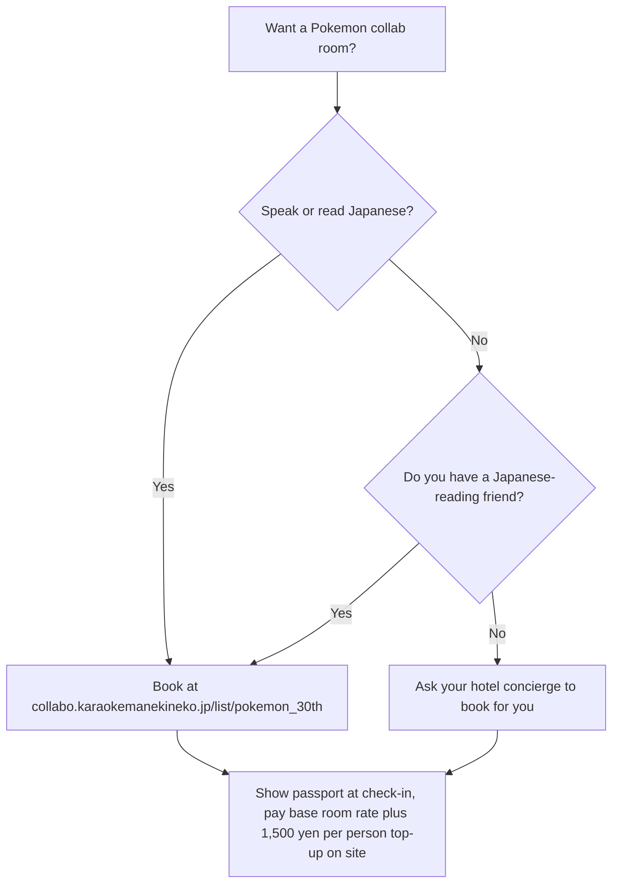

<em>Last updated: April 20, 2026. Dates, store counts, and giveaway rules re-checked against the official Karaoke Manekineko collaboration page and the Koshidaka Holdings press release on the same day.</em>

<strong>Disclosure:</strong> This article contains affiliate links. We may earn a commission if you book through these links, at no extra cost to you.

*Pokemon 30th x Karaoke Manekineko — one themed collab room per prefecture, launching April 24, 2026*

**Pokemon 30th Anniversary x Karaoke Manekineko opens April 24, 2026 at 13:00 JST across about 700 Manekineko stores nationwide, with 45 dedicated Pokemon collab rooms — one room in each of 45 prefectures (the full list of Japan's 47 prefectures minus the two where Manekineko does not operate) — and 100 stores carrying the three-tier premium pack plans.** The campaign runs through **June 14, 2026**, the Pokemon Room top-up is a flat **¥1,500 per person tax included** on top of the standard Manekineko room rate, the theme is "singing" (*utau* 歌う) tied to Pokemon's 30th anniversary year, and the roster stars **Meowth** (ニャース) and **Sprigatito** (ニャオハ) alongside the rest of the cat-name (*neko/nya*) Pokemon family. Collab-room reservations opened at **18:00 JST on April 20, 2026**, which is today.

I have sung karaoke at Manekineko branches in Shinjuku, Namba, and Sapporo during past campaigns, and the "one themed room per prefecture" idea is a first in the chain's history. If you are planning a Japan trip in late April, Golden Week, or May, this is the rare collab that works the same way if you land in Tokyo, Fukuoka, or Naha — and the Meowth beer mug is the first piece of Pokemon 30th merch you cannot buy anywhere else.

<strong>The Pokemon 30th Anniversary x Karaoke Manekineko campaign (ポケモン30周年×カラオケまねきねこ) is a 2026 Koshidaka Holdings and Pokemon Company collaboration running April 24 to June 14, 2026 at about 700 Karaoke Manekineko stores, with 45 dedicated Pokemon collab rooms across 45 of Japan's 47 prefectures and three tiered premium pack plans (Monsterball, Superball, Hyperball) at 100 selected stores.</strong>

<a href="https://www.klook.com/en-US/activity/122333-jr-pass-japan/" target="_blank" rel="nofollow"><strong>Quick booking: lock in your JR Pass on Klook</strong></a> — the collab rooms are spread across 45 prefectures, so a JR Pass makes it cheap to hit two or three on the same trip (Tokyo + Osaka + Kyoto is the easy combo).

## At a Glance

| Detail | Info |
|--------|------|
| Target reader | Pokemon fans visiting Japan between April 24 and June 14, 2026 |
| Best time to visit | Weekday afternoons before 18:00 (room rates drop to **¥10 to ¥200** per 30 minutes at most branches) |
| Budget | Standard room rate + **¥1,500 per person Pokemon Room top-up (tax incl.)** + **¥200** first-time registration + one-order-per-person food or drink |
| Must-do | Book a collab-room slot to lock in the one-design clear file |
| English support | Touchscreen song remotes have an English mode; staff speak limited English — bring your passport for first-time registration |

## What Is the Pokemon 30th x Karaoke Manekineko Collab?

This is Koshidaka's biggest single-brand karaoke campaign since the chain's founding, and the first time in Manekineko's history that one IP takes over dedicated themed rooms in every prefecture simultaneously. The press release frames it around the 30th anniversary's "singing" theme, and the creative hook is that every featured Pokemon shares the cat or *nya* (ニャ) sound — the official miki800 mirror quotes Koshidaka as calling it a gathering of "ネコ・ニャのつくポケモンとその仲間たち" ("the Pokemon with cat or *nya* in their names, and their friends").

The chain runs three layers at once. First, **all 700 participating stores** get the campaign visuals, the **9 original wallpaper images** awarded randomly for singing designated songs, and the **21 playback-style cards** handed out one per food order. Second, **100 selected stores** sell the three tiered **premium pack plans** (Monsterball, Superball, Hyperball) that bundle a room rate, a drink bar, and exclusive randomized merch. Third, **45 dedicated Pokemon collab rooms** — one per prefecture — give room-level themed decor plus a limited one-design **clear file** only room users receive.

*Pokemon Center Shibuya storefront — illustrative Pokemon brand retail venue in Tokyo (not a 2026 Karaoke Manekineko collab room). Photo: Dick Thomas Johnson / [Wikimedia Commons](https://commons.wikimedia.org/wiki/File:Pok%C3%A9mon_Center_Shibuya_(52506444865).jpg), CC BY 2.0.*

**What makes it different**: the entry cost is lower than almost any other Pokemon experience in Japan. PokePark Kanto tickets run to the high thousands of yen; the Pokemon Center DX cafe is usually reservation-locked weeks in advance. At Manekineko you pay the normal per-person room rate (weekday daytime is as low as single-digit to low hundreds of yen per 30 minutes), plus the **one-drink-per-person** minimum, and you have a themed Pokemon room for an hour — before any pack plan or food upcharge.

## When and Where Can I Visit?

Campaign dates are identical nationwide, but the collab-room store list is staggered across all 45 prefectures. Premium packs are at 100 stores that overlap heavily with the collab-room 45.

| City type | Example venues | Dates | Notes |
|-----------|----------------|-------|-------|
| Tokyo | Shinjuku / Ikebukuro / Shibuya (collab-room branches) | April 24 – June 14, 2026 | Highest demand — book Apr 20-21 for GW week |
| Osaka | Namba / Umeda (collab-room branches) | April 24 – June 14, 2026 | Pair with Pokemon Center Osaka DX for a full fan day |
| Kyoto | Kawaramachi area (collab-room branch) | April 24 – June 14, 2026 | Convenient JR Pass hop from Osaka |
| All other prefectures | 1 collab room each (45 total) | April 24 – June 14, 2026 | Full list on the official reservation page |

Manekineko's 2026 room-rate bands are the same nationwide: **¥10 to ¥200** per 30 minutes before 18:00 or 19:00 depending on region, and **¥250 to ¥500** per 30 minutes after. First-time visitors pay a **¥200 registration fee** and usually need photo ID — a passport is fine.

<strong>Collab-room reservation rules:</strong> The official reservation system opened at <strong>18:00 JST on April 20, 2026</strong>. Peak slots (Friday night, Saturday all day, Golden Week) go within hours. Pokemon Room use carries a flat <strong>¥1,500 per person (tax included)</strong> top-up on top of the standard hourly room rate — a partial-hour stay still pays the full ¥1,500, and mid-session extensions are not permitted. Elementary school children and younger get a <strong>¥500 discount</strong> on the top-up. If the prefecture you want is full, the Monsterball pack at a nearby non-collab-room store is the next-best option — you still get the 21-type card and access to the 9 wallpapers.

*Karaoke Manekineko storefront — illustrative chain venue (not a 2026 Pokemon collab-room interior). Photo: Taisyo / [Wikimedia Commons](https://commons.wikimedia.org/wiki/File:Karaoke_manekineko_201108.JPG), CC BY 3.0.*

## What Is on the Menu?

Every participating store carries the collab food menu served on a campaign-exclusive original tray, and every food order triggers one randomly-selected **playback-style card** (全21種). The official lineup published so far includes **potato fries** and **wakadori karaage** (young-chicken fried chicken), with additional items to be revealed store-side on the April 24 launch.

| Item | What it is | Prices as of April 20 |
|------|------------|-----------------------|
| Original tray meal (potato fries) | Collab-themed tray, one playback card | Not yet published — see in-store menu April 24 |
| Original tray meal (wakadori karaage) | Collab-themed tray, one playback card | Not yet published — see in-store menu April 24 |
| Drink bar (one per person, minimum) | Free-refill soft drinks | Follows standard Manekineko drink-bar pricing per store |

The pack plans bundle the room rate, the drink bar, and exclusive merch. Here is the official tier breakdown from Koshidaka's announcement as carried by gamebiz and YOUTH TIME JAPAN.

| Pack | Included | Random-draw merch |
|------|----------|-------------------|
| **Monsterball Pack** | Room rate + drink bar + cup + coaster | Coaster is 1 of 21 designs |
| **Superball Pack** | Monsterball contents + acrylic stick | Acrylic stick is 1 of 9 designs |
| **Hyperball Pack** | Superball contents + premium acrylic, aurora straw, cork coaster | Premium items are a fixed set |

Specific yen prices for the three pack tiers are not yet published on the collaboration page at the time of writing and will be confirmed when April 24 in-store menus go live.

<strong>Pro tip:</strong> If you are chasing the **21 playback cards**, order cheaper single items one at a time rather than one combo — each food order earns a card, regardless of item price.

## How Do I Actually Book a Collab Room From Overseas?

The reservation system is Japanese-only and the PDF store list uses Japanese prefecture names. This is the part that trips up first-time visitors.

If you cannot read Japanese and do not have a hotel concierge, the workaround that works well in past Manekineko collabs is to walk in at a non-collab-room branch, order the pack plan at the counter with a printout of the Japanese pack name, and accept that you will not get the single-design clear file (that one is collab-room-only). You still get the cup, coaster, card, wallpapers, and optional acrylic stick.

For a structured itinerary, the easiest multi-prefecture trip is Tokyo to Kyoto to Osaka to Fukuoka by **JR Pass** — four collab rooms, three cities, one weekend.

<a href="https://www.klook.com/en-US/activity/122333-jr-pass-japan/" target="_blank" rel="nofollow"><strong>Check JR Pass prices on Klook</strong></a> — the 7-day ordinary pass pays for itself in a single Tokyo-Osaka round trip, and the collab rooms run for 52 days, so any GW or May trip timing works.

## What Giveaways Can I Actually Get?

The campaign runs four separate giveaway tracks, each with a different trigger.

1. **9 original wallpaper images (all stores)** — sing one of the designated Pokemon campaign songs. The touchscreen remote delivers the wallpaper to your phone by QR code on the spot. All 9 types are randomly distributed.
2. **21 playback-style cards (all stores)** — one random card per food item purchased. Order three separate food items, get three cards. Trading with friends in the room is the only realistic way to chase a full set.
3. **Meowth beer mug (top 100 singers, all stores)** — total singing activity is counted across the campaign period. The top 100 Manekineko-wide singers receive an original Meowth-face beer mug.
4. **Clear file (collab-room users only)** — one single design. Given automatically to anyone booked into a prefecture collab room.

## Why Japanese People Love This

Karaoke in Japan is not a novelty night out — it is the default Friday evening for office workers, the cheapest birthday venue for teenagers, and the rainy-afternoon backup plan for families. Koshidaka's Manekineko chain built its market share on the bring-your-own-food rule and on pricing that starts at single-digit yen per 30 minutes during daytime. When Pokemon and a karaoke brand line up a 30th anniversary crossover, the fan base treats it the way overseas fans treat a limited-edition Starbucks mug drop: Japanese Pokemon collector Twitter users were posting prefecture-hop itineraries within hours of the Koshidaka press release going live. The "one themed room per prefecture" structure is set up as a domestic-travel prompt — a *ibasho junrei* (居場所巡礼, "place pilgrimage") that rewards anyone who can show photos from rooms in five or six prefectures on their social feeds during Golden Week.

*Karaoke Manekineko Nagoya Nayabashi branch — illustrative chain venue exterior. Photo: 円周率３パーセント / [Wikimedia Commons](https://commons.wikimedia.org/wiki/File:Karaoke_Manekineko_Nagoya_Nayabashi_20131223.JPG), CC BY-SA 3.0.*

## Is This a Good Trip for Families or Solo Travelers?

For solo travelers, a weekday afternoon collab-room slot is the lowest-friction Pokemon experience in Japan — under an hour of total time and about **¥2,000 to ¥2,500** per person once you add the ¥1,500 Pokemon Room top-up, the base room rate, and the one-order minimum. For families, **Monsterball** or **Superball** bookings guarantee every kid goes home with a Pokemon cup and coaster; elementary-school children and younger get **¥500 off** the Pokemon Room top-up, and Manekineko allows outside food (rare among Japanese karaoke chains), so a budget bento turns the visit into a full Pokemon party.

Anime fans can chain this with the [Demon Slayer ufotable rerun cafe](/articles/demon-slayer-rerun-cafe-ufotable-2026) for a cafe-then-karaoke day in Tokyo, or with the [Apothecary Diaries Oshi-tabi Osaka shinkansen](/articles/apothecary-diaries-oshi-tabi-osaka-shinkansen-2026) tie-in for a Kansai route.

<a href="https://www.klook.com/en-US/activity/122333-jr-pass-japan/" target="_blank" rel="nofollow"><strong>Book your JR Pass on Klook now</strong></a> — the 52-day campaign window covers Golden Week, May weekends, and the first two weeks of June. Reservations for peak Golden Week slots are already filling. Start with the easiest two-prefecture combo (Tokyo-Kanagawa or Osaka-Kyoto) and expand from there.

## FAQ: Frequently Asked Questions

**Q: Do I need to speak Japanese to use Karaoke Manekineko?**

The touchscreen song-selection remote has an English mode — switch it at the pull-down language menu on the main screen. Counter staff speak limited English but are used to passport-only foreign visitors. Food and drink orders are visual enough on the room tablet that pointing works. First-time registration takes about 3 minutes with a passport.

**Q: How much does a 60-minute Pokemon Room session cost?**

Before 18:00 or 19:00 (depending on region) the standard Manekineko room rate is between **¥10 and ¥200 per 30 minutes** per person at most branches. After 18:00 or 19:00 the rate rises to **¥250 to ¥500 per 30 minutes** per person. **Pokemon Rooms add a flat ¥1,500 per person (tax included) top-up** on top of that base rate, regardless of how long your slot runs. Add the **one-order-per-person** minimum — a drink-bar is usually **¥300 to ¥400** per person, or a soft drink is about **¥300**. A weekday afternoon Pokemon Room visit with a solo booking lands around **¥2,000 to ¥2,500** all-in before any pack-plan upgrade; a weekend evening visit can reach **¥3,000 to ¥3,500** per person.

**Q: Can I walk in without a reservation?**

Yes for the general karaoke experience and the all-store giveaways (wallpapers plus cards). No for the **45 dedicated Pokemon collab rooms** — those are reservation-only through the official site. If you want a collab room and peak slots are gone, the backup is the Monsterball pack at any of the 100 pack-plan stores, which still earns you the cup, coaster, and card.

**Q: Can I get the Pokemon 30th merch from the campaign without singing?**

The **clear file** requires booking a collab room — no alternative. The **21 playback cards** require a food order. The **9 wallpapers** require singing a designated campaign song, which you can do without any pack plan upgrade. The **top-100 Meowth beer mug** is campaign-wide volume ranking and is out of reach for a one-visit tourist.

**Q: Will the same room decor be in every prefecture?**

The collab-room artwork uses the same core lineup of cat-family Pokemon (led by Meowth and Sprigatito), but the specific room layout varies by store. Koshidaka has not confirmed prefecture-unique variants, so the "45 rooms = 45 themes" hope is unconfirmed as of April 20. Treat the 45 rooms as one single themed environment distributed nationally.

## Sources

- [Karaoke Manekineko official collaboration page (Japanese)](https://collabo.karaokemanekineko.jp/list/pokemon_30th) — campaign period, ¥1,500 per person Pokemon Room top-up, reservation timing, pack plan visuals
- [Koshidaka Holdings press release on PR TIMES (Japanese)](https://prtimes.jp/main/html/rd/p/000000029.000037296.html) — 45-prefecture collab-room count, 700-store scope
- [YOUTH TIME JAPAN event coverage (Japanese)](https://www.ytjp.jp/2026/04/17/event-pokemon) — pack-tier breakdown, giveaway mechanics, food menu hints
- [collabo-cafe.com campaign brief (Japanese)](https://collabo-cafe.com/events/collabo/pocket-monster-karaoke-manekineko-campain-2026/) — 21-card playback giveaway rule, 9-wallpaper rule, ¥500 elementary-and-younger discount

## More Pop-Culture Guides

- [Rilakkuma Cafe Tokyo Osaka 2026: Shibuya 109 Booking and Menu Guide](/articles/rilakkuma-cafe-tokyo-osaka-2026)
- [Demon Slayer ufotable Rerun Cafe 2026: Tokyo and Osaka Guide](/articles/demon-slayer-rerun-cafe-ufotable-2026)
- [Apothecary Diaries Oshi-Tabi Osaka Shinkansen 2026 Guide](/articles/apothecary-diaries-oshi-tabi-osaka-shinkansen-2026)
- [Akihabara Arcade Rhythm Games Guide 2026](/articles/akihabara-arcade-rhythm-games-guide-2026)
- [Krispy Kreme Mario Galaxy Shibuya 2026](/articles/krispy-kreme-mario-galaxy-shibuya-2026)

<strong>Follow <a href="https://www.threads.net/@pop_now_jp" rel="nofollow" target="_blank">@pop_now_jp on Threads</a></strong> for daily Japan pop culture updates.

