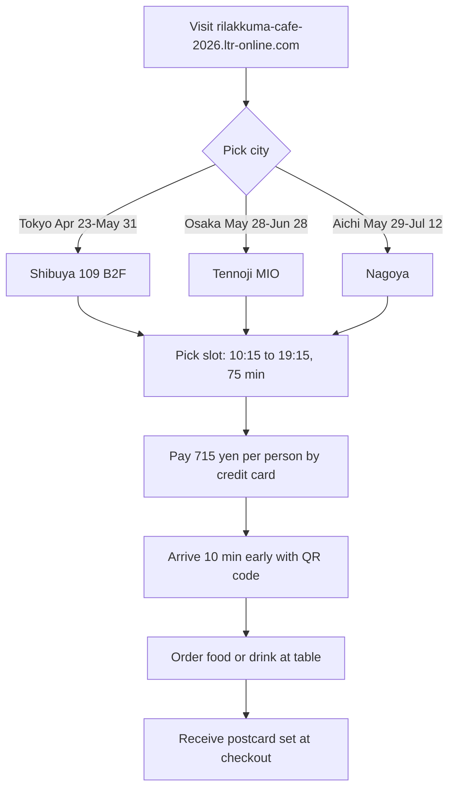

<em>Last updated: April 19, 2026. Prices, dates, and reservation rules re-checked against the official site at rilakkuma-cafe-2026.ltr-online.com on the same day.</em>

<strong>Disclosure:</strong> This article contains affiliate links. We may earn a commission if you book through these links, at no extra cost to you.

*SHIBUYA 109 basement two — the first stop of the Rilakkuma "Relaxing Dream Trip" 2026 tour opens April 23*

**SHIBUYA 109 basement two on April 23, 2026 is the first stop of the new Rilakkuma themed cafe.** The tour *Rilakkuma Cafe Goyururi Yume no Tabi* (リラックマカフェ ごゆるり夢の旅, "A Relaxing Dream Trip") runs in three cities through July 12, 2026, and a seat here costs **¥715** as a pre-paid deposit that comes back to you as a two-card postcard set on arrival. The forest afternoon tea set is **¥2,890 to ¥3,190** with a pick-three side plate and a choice of a Rilakkuma, Korilakkuma, or Kiiroitori cake or savory main.

I booked a 13:40 Shibuya slot the day reservations opened and the April and early May windows were gone in under two hours — the new TV anime airing this spring is pulling a wave of new fans on top of the usual Rilakkuma crowd. Here is exactly what to expect, the pre-arrival steps that trip up overseas visitors, and the cross-city dates if Tokyo is already full when you check.

<strong>Rilakkuma Cafe Goyururi Yume no Tabi (リラックマカフェ ごゆるり夢の旅) is a 2026 San-x themed cafe tour produced by LEGS Company's BOX cafe&space operation, running at SHIBUYA 109 in Tokyo from April 23 to May 31, then BOX cafe&space Tennoji MIO in Osaka from May 28 to June 28, and collabo index Nagoya PARCO from May 29 to July 12, with a forest afternoon tea menu and original merchandise featuring the two new anime characters Awawaneko (あわわネコ) and Yobee (よびー).</strong>

<a href="https://www.klook.com/en-US/activity/23-shibuya-pass/" target="_blank" rel="nofollow"><strong>Quick booking: grab a SHIBUYA 109 and Shibuya attraction bundle on Klook</strong></a> — useful if you are making the cafe the anchor of a half-day Shibuya trip, since the pass also covers nearby shopping floors and a few photo-spot attractions.

## At a Glance

| Detail | Info |
|--------|------|
| Target reader | San-x character and kawaii fans visiting Japan between late April and mid July 2026 |
| Best time to visit | Tokyo weekday mornings (opening slots at 10:15 and 11:30) |
| Budget | **¥715** deposit + **¥2,890 to ¥3,190** afternoon tea set + merch if tempted |
| Must-do | Order a Rilakkuma main cake and keep the flower-shaped tea tag that comes with any drink |
| English support | No English menu, no English site. Staff at SHIBUYA 109 handle simple point-and-order politely |

## What Is the Rilakkuma "Relaxing Dream Trip" Cafe?

This is San-x's biggest themed cafe since the last Rilakkuma anniversary tour, and it is the first one timed to an active anime broadcast. The TV anime *Rilakkuma* series began streaming this April, and the cafe's story — a loose "forest holiday" where Rilakkuma and Korilakkuma discover a sleepy woodland — mirrors the anime's pastel woodland art direction.

The producers are the same team behind most BOX cafe&space collaborations, so the format is familiar if you have done a Jujutsu Kaisen or Chainsaw Man cafe: a **75-minute seated slot**, a **pre-paid deposit** that secures your table, an **original menu** that rotates for the tour, and an **on-site merch counter** with items you cannot buy on Amazon JP. Unlike most BOX cafes this one also runs a parallel online store on the official site until the Nagoya leg ends.

**What makes it different**: two new anime characters appear for the first time on physical merch. *Awawaneko* (あわわネコ, "bubble cat") is Rilakkuma's flustered new friend introduced in the anime; *Yobee* (よびー) is a tiny bird-like creature who tags along. Both show up on the acrylic keychains and magnets, and this cafe tour is the first place to buy them in person.

## When and Where Can I Visit?

Three venues, staggered so that if Tokyo sells out you can still make Osaka or Nagoya a later stop on the same trip.

| City | Venue | Address (nearest station) | Dates | Hours |
|------|-------|---------------------------|-------|-------|
| Tokyo | BOX cafe&space SHIBUYA109 | 2-29-1 Dogenzaka, Shibuya-ku, SHIBUYA 109 B2F (Shibuya Station, 3-min walk) | April 23 – May 31, 2026 | 10:15 – 20:30 |
| Osaka | BOX cafe&space Tennoji MIO | 10-39 Hidenincho, Tennoji-ku, Osaka, Tennoji MIO Main Building 11F (Tennoji Station, connected) | May 28 – June 28, 2026 | See venue page |
| Aichi | collabo index Nagoya PARCO | 3-29-1 Sakae, Naka-ku, Nagoya, Nagoya PARCO (Yabacho Station, 1-min walk) | May 29 – July 12, 2026 | See venue page |

The Shibuya slot runs 13 reservations a day in 75-minute windows, with the first slot beginning at 10:15 and the last at 19:15. You arrive 10 minutes before your slot time for check-in. Same-day phone reservations are not accepted, but if you wander in during a slow weekday afternoon the host will seat walk-ins when a booked party does not turn up — no guarantee, though, and the queue on opening week is already long.

<strong>Reservation deadline:</strong> Online booking closes at 15:00 the day before your visit. If you decide on Tuesday morning that you want a Wednesday seat, you are already locked out of the online system.

## What Is On the Menu?

The centerpiece is the **Forest Afternoon Tea Set** (森のアフタヌーンティーセット), priced by which drink you pair it with.

| Set | Price (tax in) | What you pick |
|-----|----------------|---------------|
| Nonbiri Coffee or Hokkori Tea | **¥2,890** | Main + 3 sides |
| Yasuragi Herbal Tea | **¥2,990** | Main + 3 sides |
| Komorebi Fruit Tea | **¥3,190** | Main + 3 sides |

**Main plate** — pick one of two:

- *Savory* — an egg salad and ratatouille pocket folded in soft bread, with the choice of a Rilakkuma, Korilakkuma, or Kiiroitori face
- *Cake* — a dome of yogurt cream and cocoa biscuit, again in your pick of the three character faces

**Side plate** — pick three of six:

- Tacos tart
- Prosciutto and cheese pancake
- Miso gratin tart
- Peach pancake
- Tree-stump chocolate cake
- Honey lemon tart

*The forest afternoon tea set — three sides from a menu of six, plus a character main cake or savory*

**My ranked picks for the three sides** (based on the menu card photos, the ingredient mix, and how previous BOX cafe side plates have held up on past collabs I have sat through):

1. **Tree-stump chocolate cake** — the most photogenic plate on paper, and dark chocolate balances the sweet Rilakkuma teas. Order it first so it does not melt.
2. **Honey lemon tart** — light and citrusy, and the only side on the list that works as a palate cleanser between the richer items.
3. **Prosciutto and cheese pancake** — the best savory pick if your main is the cake; skip it if your main is already the savory bread pocket.

The three I would pass on first if pacing matters: peach pancake (sweet on sweet if you also picked the cake main), tacos tart (too dense for afternoon tea), and miso gratin tart (strong miso competes with the signature teas).

If you are not hungry enough for a full set, the drinks alone are worth ordering. Each of the four signature drinks comes with a **free flower-shaped tea tag** that you are allowed to take home, which is a rare extra in a Tokyo collab cafe where most free take-home items cost extra.

| Drink | Price (tax in) | Style |
|-------|----------------|-------|
| Nonbiri Coffee | **¥990** | Signature latte |
| Hokkori Tea | **¥990** | Signature milk tea |
| Yasuragi Herbal Tea | **¥1,090** | Caffeine-free herbal blend |
| Komorebi Fruit Tea | **¥1,290** | Seasonal fruit tea |

Side drinks (hot or iced coffee, hot or iced tea, cola, orange juice, ginger ale) are a flat **¥690** if you want to keep the bill down or add a second cup.

## How Do I Reserve From Overseas?

Reservations open a month before each city on a first-come basis. The official site is Japanese-only but the booking flow has the same shape as Lawson Ticket, so walking through it is manageable.

1. Go to the official cafe site at **rilakkuma-cafe-2026.ltr-online.com** during reservation hours.
2. Pick the city (Tokyo / Osaka / Aichi), then pick a date and one of the 13 time slots.
3. Enter your number of guests — maximum four per booking.
4. Pay the **¥715** deposit per person by credit card. That deposit is the seat-hold; it is refunded as a two-card postcard set on arrival, not as cash.
5. Save the booking email and QR code — that is what the host scans at check-in.

Overseas credit cards work for most major brands, but I have seen Mastercard debit cards bounce on this payment provider. If the card fails, a Visa credit card is the safest backup. Cancellations are allowed but the deposit is not refunded in cash — you simply lose the ¥715.

<strong>Pro tip:</strong> Book a weekday slot between 14:00 and 16:30. The 10:15 and lunch slots draw families and after-school crowds, while the 19:15 final slot often rushes the plating. Mid-afternoon is when the staff have time to chat.

## What Merchandise Can I Buy?

Merchandise sales run during cafe hours at the same venue and online at the official site from April 23 through July 12, 2026. Shipments from the online store begin in early August 2026, which is too late if you are flying home first — buy in person or use a forwarder.

| Item | Price (tax in) | Purchase limit |
|------|----------------|----------------|
| Stickers (6 types, random) | **¥605** | 6 per person |
| Can magnets (10 types, random) | **¥715** | 10 per person |
| Twin acrylic keychains (4 types) | **¥990** | 4 per person |
| Tea spoons (4 varieties) | **¥1,100** | 3 per variety |
| Marble coasters | **¥1,320** | 3 per person |
| Tea mug cup | **¥2,090** | 3 per person |

The twin acrylic keychains are the first place the new anime characters Awawaneko and Yobee have ever been sold as physical merch, so those four designs are moving fastest. If your flight leaves before you can revisit, the online store covers the same range — but a proxy shipping service like **Buyee** or **Blackship** (Japanese sites will ship to them, and they forward to your home country) is faster than waiting for August shipments. Search "リラックマ BOX cafe" on either service during the cafe run.

*The on-site merchandise counter — twin acrylic keychains featuring new anime characters Awawaneko and Yobee sell out first*

## Who Are Awawaneko and Yobee?

These two are the headline reason San-x fans are treating the 2026 anime as a soft reboot rather than just another series. Awawaneko (あわわネコ) is a flustered, shy cat who panics in bubbles — the name comes from the Japanese *awawa* onomatopoeia for an "oh no, what do I do" moment. Yobee (よびー) is a small bird-like sidekick whose role in the anime is still being revealed episode by episode.

They appear on the merchandise line, on one side plate design, and as a subtle motif on the postcard reservation bonus. For collectors this cafe tour is a first-wave moment — by the time larger San-x retail floors pick up the characters later in 2026, the early cafe-exclusive acrylic designs will be resale-only.

## Can I Build a One-Hour Shibuya Plan Around It?

Yes, and SHIBUYA 109 is the easiest of the three venues for a tourist itinerary. A workable hour looks like this: arrive 10:05 for a 10:15 slot on the basement-two floor, check in with the host, sit down, and order within five minutes of being seated. Kitchens batch orders by slot, so your plate lands about 15 minutes after you sit down. You have 75 minutes by the clock, and staff will gently flag you at 70. That leaves you thirty minutes to photograph the dish, eat, and browse the merch counter on your way out.

**What I got wrong the first time on this kind of cafe, and how I fix it now**: my first BOX cafe booking years ago, I arrived three minutes past the slot time thinking a cafe reservation had a grace window. It does not. The table was released to a walk-in and I lost the seat and the deposit. Now I treat the "arrive 10 minutes early" note as firm — I set a phone alarm for 20 minutes before the slot, and I wait in the SHIBUYA 109 basement lobby rather than browsing upstairs.

After the cafe, SHIBUYA 109's ground floor connects in one minute to the Shibuya Scramble Crossing, and the back of 109 drops you into Dogenzaka's ramen and dessert street. **My routine**: cafe at 14:00, Scramble photo at 15:15, and either a Parco visit (10 minutes away) or a Shibuya Stream walk toward Shibuya Sky (20 minutes away) for sunset. That three-stop loop is the anchor of a lot of first-time Tokyo days, and the cafe slots in without breaking the rest.

<strong>Cross-silo tip:</strong> Many Tokyo anime spots sit within ten minutes of Shibuya. See the <a href="/articles/tokyo-anime-collab-cafes-spring-2026">Tokyo collab cafe spring roundup</a> for what else is open the same week, or the <a href="/articles/shibuya-anime-guide-2026">Shibuya anime area guide</a> for walking routes and hotel picks.

**Ready to lock in the cafe plus Shibuya attractions in one booking?** [Compare Shibuya Sky tickets and Shibuya passes on Klook](https://www.klook.com/en-US/activity/24731-shibuya-sky-ticket-tokyo/) — you can add a sunset slot at Shibuya Sky or a Tokyo Metro day pass alongside your cafe reservation and skip the separate ticket machines at the station.

## Why Japanese People Love Rilakkuma

Rilakkuma started life in the early 2000s as a kawaii brand built on a single idea: *iyashi* (癒し, "healing"). The character is explicitly a bear suit with an unnamed person inside — the zipper on the back is canon — which lets fans project whoever they want onto it. For a country that runs on a long office week, a bear whose only job is to nap on the sofa became shorthand for "permission to rest."

The 2026 anime leans into that even harder. Each episode is a short vignette about doing nothing productive — sharing a snack, watching a leaf fall, wondering why the curtain is stuck. That tone is why the cafe's "forest holiday" framing feels on-brand rather than marketing-driven. For Japanese fans in their thirties and forties, the cafe trip is a way to give themselves a sanctioned pause; for younger fans, the new anime characters make it a fresh collectable moment rather than a nostalgia run.

## FAQ: Frequently Asked Questions

### How much does a visit to the Rilakkuma Cafe at Shibuya 109 cost?

Budget roughly **¥3,600 to ¥4,000** per person for a seat with the afternoon tea set. That is a **¥715** deposit that returns to you as a postcard set, plus one of the three afternoon tea sets at **¥2,890 to ¥3,190**. Add **¥605 to ¥2,090** if you buy from the merchandise counter on the way out.

### Do I need to speak Japanese to book?

Not much, but you do need to read it. The official booking site (rilakkuma-cafe-2026.ltr-online.com) is Japanese-only — browser translation handles the form well enough to pick city, date, and slot, then pay by credit card. The cafe itself uses a point-and-order menu once you sit down, so no spoken Japanese is required on the day.

### Can I visit without a reservation?

Walk-ins are accepted only if a booked party does not show, so there is no guaranteed walk-in path, especially on opening week in Tokyo. If you are in Shibuya without a booking, ask the host at the cafe entrance whether the next slot has openings. Your chance is highest on weekday afternoons between 14:30 and 17:00.

### How does the ¥715 deposit work?

You pay **¥715** per person by credit card when you book. That payment is not a ticket fee — it is a seat-hold. When you arrive the staff check you in, seat you, and hand you a two-card postcard set to offset the deposit. You still pay for any food or drink on top of that. If you cancel, you lose the ¥715.

### Are the Tokyo, Osaka, and Nagoya menus the same?

Yes, the menu, merchandise, and postcard bonus are identical across all three cities. The only differences are the venue building, reservation timing (Osaka opens roughly one month before its dates, Nagoya the same), and local crowd patterns — Osaka's Tennoji MIO has shorter waits than Shibuya on average.

<a href="https://www.klook.com/en-US/activity/23-shibuya-pass/" target="_blank" rel="nofollow"><strong>Book your Shibuya experience now on Klook</strong></a> — the 109 bundle pairs cleanly with the cafe if you are flying in specifically for this tour.

## More Collab Cafe Guides

- [How to Book Anime Collab Cafes in Japan](/articles/how-to-book-anime-collab-cafe-japan) — Step-by-step reservation guide for BOX cafe, Lawson Loppi, and Sweets Paradise
- [Tokyo Anime Collab Cafes Spring 2026](/articles/tokyo-anime-collab-cafes-spring-2026) — What else is open the same week as Rilakkuma
- [Demon Slayer Rerun Cafe ufotable 2026](/articles/demon-slayer-rerun-cafe-ufotable-2026) — Current ufotable tie-in running alongside
- [Blue Lock Tokyo Skytree Cafe 2026](/articles/blue-lock-tokyo-skytree-cafe-2026) — Another Tokyo cafe with a BOX cafe-style booking flow
- [Shibuya Anime Area Guide 2026](/articles/shibuya-anime-guide-2026) — The walking routes around the same station

<strong>Follow <a href="https://www.threads.net/@pop_now_jp" rel="nofollow" target="_blank">@pop_now_jp on Threads</a></strong> and <strong><a href="https://x.com/pop_now_jp" rel="nofollow" target="_blank">X</a></strong> for Tokyo cafe opening alerts and spring 2026 slot drops.

