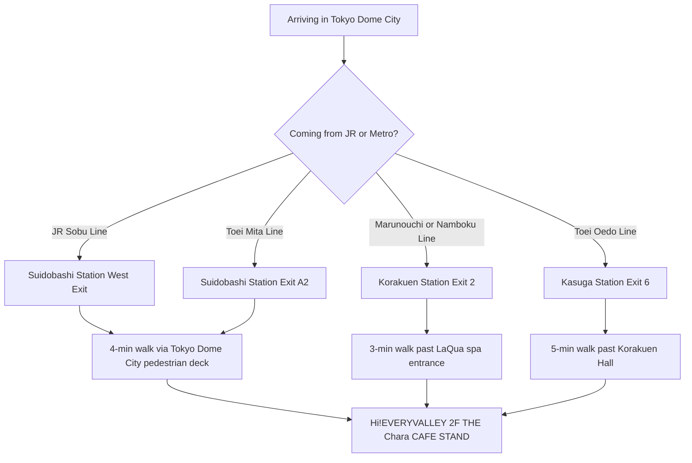

<strong>Disclosure:</strong> This article contains affiliate links. We may earn a commission if you book through these links, at no extra cost to you.

*Photo: Dick Thomas Johnson / [Wikimedia Commons](https://commons.wikimedia.org/wiki/File:Tokyo_Dome_City_2016_(32416278402).jpg), CC BY 2.0. Tokyo Dome City pedestrian deck — Hi!EVERYVALLEY 2F, where THE Chara CAFE STAND runs the World Trigger Festival 2026 takeover from April 27 to May 10.*
**THE Chara CAFE STAND at Tokyo Dome City turned over to the World Trigger Festival 2026 collab on April 27**, and runs through **May 10, 2026**, a 14-day window that covers all of Golden Week. The slot has been on Wartri fan radars since the Festival 2026 stage drop on April 26; the Hi!EVERYVALLEY 2F counter is, by reputation, one of the cleanest weekday-cafe pulls in central Tokyo. The stand sits on **Hi!EVERYVALLEY 2F** at 1-3-61 Koraku, Bunkyo-ku — the "Yellow Building" corner of Tokyo Dome City, four minutes from JR Suidobashi and three minutes from Korakuen Station. It is a **takeout-only** stand, **cashless only**, open **11:00 to 19:00 on weekdays** and **11:00 to 20:00 on weekends and holidays**, with last order **30 minutes before close**. Every collab menu item ships with **one random coaster from a set of 8** as a free novelty, and goods include die-cut stickers, acrylic coasters, and wire keyholders pulled from the Festival 2026 stage drawdown. Drinks are capped at **3 per transaction**; food and dessert are capped at **2 combined**. Here is the Suidobashi-side walking route, the order-limit math, and how to thread it through a Golden Week day with the surrounding Tokyo Dome City attractions.

<strong>"World Trigger Festival 2026 × THE Chara CAFE STAND" (ワールドトリガー フェスティバル2026 THEキャラ CAFE STAND 東京ドームシティ店) is the spring 2026 World Trigger (*Wartori*, ワートリ) cafe takeover at Tokyo Dome City Hi!EVERYVALLEY 2F, running April 27 to May 10, 2026 as a takeout-only cashless stand, with 1F kitchen-car day on April 26, festival-drawdown collab drinks and sweets, original goods, and a free random-coaster (8 designs) novelty per collab item ordered.</strong>
**Booking the day around it?** Klook sells the [Tokyo Subway 24-hour Ticket from 800 yen](https://www.klook.com/en/activity/1780-tokyo-subway-ticket/?aff_adid=1251547&aff_label=world-trigger-festival-2026-top) in English with QR delivery — Marunouchi Line drops you at Korakuen Station Exit 2, three minutes from the stand. Same pass also covers a same-day jump to Akihabara for the Animate Wartori shelf if you want to extend the run.

## What you need to know
<ResponsiveTable label="World Trigger Festival 2026 cafe at a glance">
| Detail | Info |
| --- | --- |
| Target Reader | World Trigger fans visiting Tokyo over Golden Week 2026 who want a low-friction takeout cafe experience next to a major tourist anchor |
| Best Time to Visit | Weekday lunch slots (12:00 to 13:30), fully avoids the weekend Tokyo Dome event-day surge into Hi!EVERYVALLEY |
| Budget | **2,000 to 4,500 yen** per person (1 collab drink + 1 collab food/dessert + 1 small goods item) |
| Must-Do | Pair the order so you collect at least one coaster from the 8-design random set, then walk the Hi!EVERYVALLEY 1F container row |
| English Support | No English menu in store — staff handle pointing-and-paying fine; cashless-only takes overseas Visa and Mastercard, no JPY cash needed |
| Event Dates | April 27 to May 10, 2026 (14 days). Kitchen-car preview April 26 only on Hi!EVERYVALLEY 1F |
</ResponsiveTable>

## What Is the World Trigger Festival 2026 Cafe?
This is a **takeout cafe stand**, not a sit-down themed restaurant. THE Chara CAFE STAND is a rotating-collab venue inside Tokyo Dome City, the same room ran an Ultraman 60th and a Jujutsu Kaisen takeover in earlier 2026 slots — and it picks up a new IP every few weeks. For the World Trigger run, the menu and goods are pulled from the **Festival 2026 stage event** held at the same site on April 26, with brand-new drawdown illustrations from that event applied to the drinks, sweets, and merch.
The official source page is [the-chara.com's World Trigger Festival 2026 page](https://www.the-chara.com/blog/?p=113226), which holds the operating times, payment rules, and the menu and goods images. The Festival 2026 stage's official site at [toei-anim.co.jp/lp/wt/stage_2026](https://www.toei-anim.co.jp/lp/wt/stage_2026/) carries the same key visual the cafe leans on, and [collabo-cafe.com's coverage](https://collabo-cafe.com/events/collabo/world-trigger-cafe-stand-tokyo-dome-city-2026/) mirrors the lineup and adds sell-out tracking as the run progresses. Live updates including same-day sell-outs and Hi!EVERYVALLEY queue length are posted by the cafe's own X account [@thechara_TDC](https://x.com/thechara_TDC).
Visitors to recent THE Chara CAFE STAND collabs (the late-2025 Ultraman 60th and the early-2026 Jujutsu Kaisen takeovers ran in the same room) describe the rhythm as simple, order at the counter, wait three to five minutes, and either take it to a Hi!EVERYVALLEY bench or out to the LaQua spa courtyard. World Trigger should run the same way; the IP is shōnen-action, not character-cafe-tourism, so families and weekend Tokyo Dome event-goers absorb most of the foot traffic and the line moves.

## What Is on the Menu? Drinks, Sweets, and the Coaster Rule
Two course types anchor the lineup — **character-themed collab drinks** and **collab sweets** built around World Trigger motifs from the Festival 2026 drawdown set. THE Chara CAFE STAND's standard format runs drinks in the 700 to 900 yen band and sweets in the 1,000 to 1,400 yen band; the World Trigger menu image on the official page shows the same shelf placement and the early-run prices for past collabs at this stand. Confirm the exact yen at the cashier, since item rotation does happen during a 14-day run.
The menu page is firm on one rule that matters: **every collab menu item earns one random coaster from a set of 8 designs, free**. Treat this as the math anchor of the visit. Order one drink and one sweet and you walk away with two coasters, **but the order cap is 3 drinks and 2 food or dessert items per transaction**. If you are travelling as a duo or trio, splitting the orders into two separate transactions is allowed and gets you more coasters legitimately, with the cashier's blessing.

<ResponsiveTable label="World Trigger Festival 2026 cafe menu structure and order rules">
| Course | Format | Approximate Price | Notes |
| --- | --- | --- | --- |
| Collab drink | Character-themed, takeout cup | **700 to 900 yen** | Max 3 per transaction; 1 coaster awarded per drink |
| Collab food or dessert | Character-themed plate, takeout box | **1,000 to 1,400 yen** | Max 2 combined per transaction; 1 coaster awarded per item |
| Grand-menu item (non-collab) | Standard cafe drink or food | **500 to 900 yen** | Coaster bonus does **not** apply to grand-menu items |
| Free novelty | Random coaster from a set of 8 | **0 yen** | Awarded only on collab items, while supplies last, no exchanges |
</ResponsiveTable>

<strong>Pro tip:</strong> Order at least one collab drink AND one collab dessert — that splits the chance across two coaster pulls instead of doubling up on one category, and the takeout box is small enough that the dessert holds for the walk to the Tokyo Dome roller-coaster benches outside.

The cafe also publishes one strict warning on the official page worth taking seriously: **resale of the coaster novelty is forbidden**, and unused or damaged coasters cannot be exchanged. If you want a specific design, you order again, there is no swap counter.

## How Do I Get There From Suidobashi or Korakuen?

*Photo: MaedaAkihiko / [Wikimedia Commons](https://commons.wikimedia.org/wiki/File:JRE_Suidobashi-STA_East.jpg), CC BY-SA 4.0.*
The stand is at **Hi!EVERYVALLEY 2F, Tokyo Dome City — 1-3-61 Koraku, Bunkyo-ku**, in the building locals call the "Yellow Building" (黄色いビル). Five Tokyo subway and JR lines stop within four minutes' walk, which is the main reason this cafe slot is friendlier to overseas travellers than the typical reservation-only ufotable or Animate Cafe.

For overseas visitors the cleanest combination is **Marunouchi Line to Korakuen Station Exit 2**, then a three-minute walk past the LaQua spa entrance, ramp up to Hi!EVERYVALLEY's 2F open deck, and the cafe stand is the third storefront on the right. **JR Suidobashi West Exit** is the second-cleanest option for travellers using a JR Pass, you cross one pedestrian deck and arrive at the same 2F level.
The Tokyo Dome City English site provides a [Hi!EVERYVALLEY area map](https://www.tokyo-dome.co.jp/en/hi-everyvalley/area/) and [step-by-step access page](https://www.tokyo-dome.co.jp/en/hi-everyvalley/access/) that confirm the ramp routing without Japanese skills required.

<strong>Background:</strong> Hi!EVERYVALLEY is a container-style food and event row that opened on the 1F and 2F of the Yellow Building corner of Tokyo Dome City. THE Chara CAFE STAND occupies one of the 2F units and runs anime collab takeovers on a roughly two-to-four-week cycle — earlier 2026 slots ran Jujutsu Kaisen, Ultraman, AHS & TOKYO6, and Okami 20th. World Trigger is the late-April 2026 IP.

## What Goods Can I Buy and How Many of Each?
Three goods categories are confirmed on the official page: **die-cut stickers, acrylic coasters, and wire keyholders**, plus an unspecified additional drawdown-illustration item line. All goods carry the original Festival 2026 stage illustrations, distinct from anything Animate or Anime Store sells in their parallel World Trigger merch shelves.
The cap rules are explicit and worth reading **before** you start filling a basket:
- **Blind goods (random pull, design hidden until purchase):** maximum **20 of each blind line per transaction**.
- **Open goods (visible design):** maximum **2 of each variant per transaction**. So if a line ships 6 acrylic stand designs A through F, you can take home **2 of A, 2 of B, 2 of C, 2 of D, 2 of E, and 2 of F** in one transaction. 12 in total.
Defective goods are exchanged in-store **within two weeks of the campaign end**, and the cafe is firm that surface-print micro-flaws (small scuffs, corner dents, tiny print variation) are not treated as defects.

<strong>Heads up:</strong> The stand is **fully cashless** — credit card, transit IC card, and QR code payment only. No JPY cash accepted. If your card has not been used in Japan before, run a 100-yen test transaction at a Suidobashi konbini before queuing, since first-card-use blocks happen often enough to ruin a coaster pull.

## How Do I Build Half a Day Around the Cafe?

*Photo: Kakidai / [Wikimedia Commons](https://commons.wikimedia.org/wiki/File:LaQua(Tokyo_Dome_City_).jpg), CC BY-SA 4.0.*
Tokyo Dome City packs four tourist-grade attractions inside a five-minute walking circle from the cafe, which makes this the rare anime collab where the surrounding venues are stronger than the cafe's own seating. A clean half-day for a Golden Week visitor:
1. **10:30**. Korakuen Station Exit 2, walk to LaQua spa lobby for cloakroom drop-off.
2. **11:00**. Hi!EVERYVALLEY 2F, queue THE Chara CAFE STAND opening.
3. **11:30** — Eat the collab dessert on the LaQua courtyard benches; pull the coaster.
4. **12:00**. Tokyo Dome City Attractions — Thunder Dolphin coaster pass.
5. **13:30**. LaQua spa session for an Onsen-format afternoon.
6. **15:30** — Walk to Korakuen Garden East Gate for spring greenery.
For the JR Pass crowd a **Suidobashi → Akihabara JR Sobu Line** hop adds the Animate flagship's World Trigger shelf in nine minutes, useful if you want to compare the cafe's drawdown coasters against Animate's open-design merch line.
**Stay overnight in the area?** Booking.com lists [Korakuen and Suidobashi hotels](https://www.booking.com/searchresults.html?ss=Korakuen+Tokyo&aid=placeholder&label=world-trigger-festival-2026) from around 11,000 yen per night for Golden Week dates — staying inside Tokyo Dome City means you can run the cafe twice (different transactions, different coaster pulls) on consecutive days without burning two transit fares.

## What makes this attraction stand out

*Photo: ITA-ATU / [Wikimedia Commons](https://commons.wikimedia.org/wiki/File:Tokyo_Dome_City_Attractions_162013-2.JPG), CC BY-SA 4.0.*
World Trigger sits in a peculiar slot in the Japanese shōnen world, it has **15 million-plus copies in print** since the 2014 launch, a Toei Animation TV run that aired across 2014 to 2022 in three seasons, and a 2026 reboot project that was teased at Jump Festa in December 2025. Its fanbase skews older and more loyal than the typical *Weekly Shōnen Jump* IP because the manga has run irregularly while the author manages his health, and that scarcity has turned every Festival event into a reunion. The Festival 2026 stage and this cafe collab are not promotional fluff for a season-launch — they are the social glue holding a 12-year fandom together while the new anime gets ready, which is why Japanese fans treat the coaster set with collector-level care rather than as a casual goods drop. The Tokyo Dome City venue choice is also signal: it is a working tourist district, not an Akihabara goods alley, which says **the IP is being positioned for a wider 2026 audience** ahead of the reboot's broadcast.

## More Cafe and Tokyo Guides
- [Demon Slayer Handmade Club at ufotable Cafe (Apr 28 – May 31)](/articles/demon-slayer-handmade-club-ufotable-cafe-2026), the same Golden Week window, reservation-driven, opposite of this takeout stand
- [Dark Moon Chara Cafe Ikebukuro 2026](/articles/dark-moon-chara-cafe-ikebukuro-2026) — sister Chara Cafe location, different IP
- [Lawson Ticket and Loppi anime cafe booking guide](/articles/lawson-ticket-anime-cafe-booking), for the reservation-only collabs around Tokyo
- [Japan IC card transit guide](/articles/japan-ic-card-transit-guide) — Suica or PASMO covers the Korakuen and Suidobashi side fully
- [JJK Sweets Paradise complete guide 2026](/articles/jjk-sweets-paradise-complete-guide-2026), same shōnen-IP cafe vibe, walk-in friendly
- [Golden Kamuy Golden Week Shinjuku Popup 2026](/articles/golden-kamuy-golden-week-shinjuku-popup-2026) — the other Tokyo walk-in shōnen popup running the same Golden Week window
- [Re:Zero × Cure Maid Café Akihabara 2026 Visitor Guide](/articles/re-zero-curemaid-cafe-akihabara-2026), sister Tokyo single-venue collab cafe with a Golden Week window
- [Ranma 1/2 Japan 2026 Exhibition + Tree Village Pop-Up Guide](/articles/ranma-japan-2026-exhibition-tree-village-guide) — the Sunshine City exhibition + Tree Village Tokyo/Osaka/Hakata pop-up cafe legs

## Book Your Tokyo Dome City Day
The fastest way to bundle the cafe with Tokyo Dome's bigger attractions is the [Klook Tokyo Dome City Attractions one-day pass](https://www.klook.com/en/activity/2-tokyo-dome-city-attractions/?aff_adid=1251547&aff_label=world-trigger-festival-2026-bottom), booked in English, QR-delivered, and good for the Thunder Dolphin coaster, the Big-O Ferris wheel, and the surrounding rides. Pair it with the cafe run on a weekday and the whole half-day costs less than a single inbound shinkansen leg.

## FAQ: World Trigger Festival 2026 Tokyo Dome City Cafe
**Q: Do I need a reservation for the World Trigger Festival 2026 cafe stand?**
No reservation — THE Chara CAFE STAND is a takeout walk-up. Queue at the counter on Hi!EVERYVALLEY 2F, order, and wait three to five minutes for the takeout cup or box. The only timing rule is **last order 30 minutes before close** (18:30 weekdays, 19:30 weekends and holidays).
**Q: Can I pay in cash at the cafe?**
No. The stand is fully cashless, credit cards (Visa, Mastercard, JCB, AMEX), transit IC cards (Suica, PASMO, ICOCA), and QR code payments work. Run a 100-yen test transaction at a Suidobashi konbini before you queue if your card has not been used in Japan before.
**Q: How does the free coaster novelty work?**
Order one collab menu item — drink, food, or dessert, and you receive **one random coaster from a set of 8 designs**, free. The bonus does not apply to grand-menu (non-collab) items. Designs are random, no swaps allowed, and resale of the coaster is forbidden by the cafe's stated rules.
**Q: What are the order limits per transaction?**
Drinks are capped at **3 per transaction**, food and dessert at **2 combined**. For goods, blind-pull lines cap at **20 of each line per transaction**, and open-design lines cap at **2 of each visible variant per transaction**. Splitting into two separate transactions is allowed at the cashier's discretion when the queue is short.
**Q: How do I get to Hi!EVERYVALLEY 2F from JR Suidobashi or Korakuen Station?**
From **Korakuen Station Exit 2** (Marunouchi or Namboku Line), three minutes via the LaQua spa entrance ramp. From **JR Suidobashi West Exit**, four minutes via the Tokyo Dome City pedestrian deck. From **Toei Mita Line Suidobashi A2** or **Oedo Line Kasuga Exit 6**, five minutes via the Korakuen Hall side.

<strong>Follow <a href="https://www.threads.net/@pop_now_jp" rel="nofollow" target="_blank">@pop_now_jp on Threads</a></strong> for daily Tokyo pop culture updates including same-day sell-out alerts on Hi!EVERYVALLEY collab drops.

