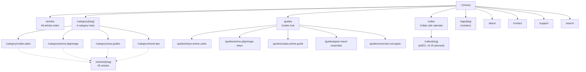
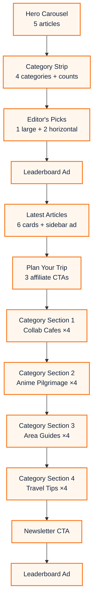
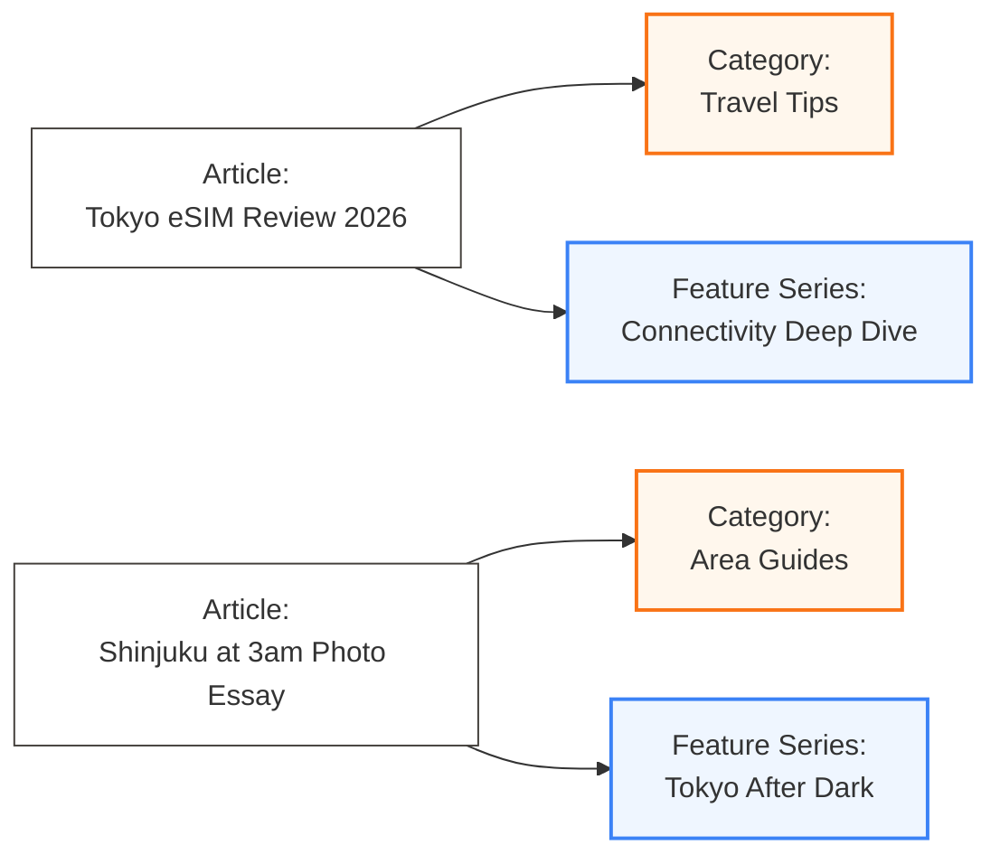
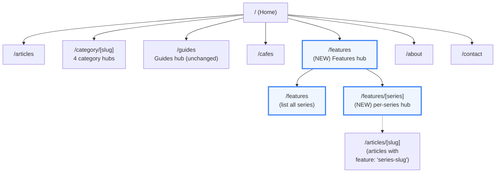
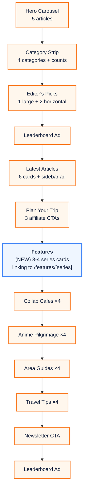

# Site Structure — As-Is / To-Be (2026-04-10)

Prepared as the K → J pre-work. Before implementing the Features 5th axis on the Home page, this document captures the current information architecture and the target architecture so the work stays coherent with SEO, internal linking, and the user's long-term content strategy.

## 1. As-Is — Current Structure (2026-04-10)

### 1.1 Top-level routes



### 1.2 Home page sections (As-Is)



### 1.3 Content taxonomy (As-Is)

Articles sit on two orthogonal axes only:

| Axis | Cardinality | Example |
|---|---|---|
| Category | 4 fixed (Collab Cafes, Anime Pilgrimage, Area Guides, Travel Tips) | `category: "collab-cafes"` |
| Tags | ~80 freeform | `tags: ["tokyo", "chainsaw-man"]` |

Tags are `noindex` so they don't compete for search, but they're useful for internal linking. There's **no mechanism for grouping articles into long-running series or editorial columns** — if a writer starts a series like "Tokyo After Dark" or "Quiet Pockets of Kyoto", the only ways to represent it today are (a) a tag that nobody discovers, or (b) a guide hub page that's manually maintained.

### 1.4 Gaps identified (As-Is)

1. **No editorial column container.** Long-running series have no home. Users can't bookmark "Quiet Pockets of Japan Vol. 1-12" and expect to see Vol. 13 appear anywhere.
2. **Home is horizontal, not vertical.** The home page is designed for quick category browsing, not for surfacing depth. A user who loves our "counterculture" coverage has no path to more of it without searching.
3. **Writer incentive gap.** Without a column container, writers have no reason to brand a multi-part series because the 2nd article won't be grouped with the 1st anywhere visible.
4. **Newsletter hook is weak.** "Latest articles" is generic. "Latest in *Tokyo After Dark*" is a reason to subscribe.
5. **SEO: topic authority leaks.** Google's topical authority model rewards clear topic clusters. Our 4 categories are broad ("Travel Tips" is huge); a narrower column like "eSIM & Connectivity" or "Ticket & Booking Systems" would reinforce cluster signals for the host category.

---

## 2. To-Be — Target Structure with Features 5th Axis

### 2.1 New: Features as a 5th axis (orthogonal)

A **Feature Series** is a named editorial column. It sits *alongside* the 4 categories, not underneath them. An article can belong to:
- Exactly 1 Category (required, unchanged)
- Exactly 0 or 1 Feature Series (new, optional)
- N tags (unchanged)



### 2.2 Top-level routes (To-Be)



### 2.3 Home page sections (To-Be)



**Rationale for placement** between "Plan Your Trip" and the 4 category sections:
- "Plan Your Trip" is a commercial section (3 affiliate CTAs). Directly after is the strongest attention point for editorial variety.
- Features sits **before** the 4 category sections because it's the editorial "soul" of the site — we want visitors to see depth before they see breadth.
- It does not sit above "Latest Articles" because Latest provides news velocity, which wins on first visit.

### 2.4 Data model changes

**1. Article frontmatter — add optional `feature` field:**
```yaml
---
title: "..."
category: "travel-tips"          # existing
feature: "connectivity-deep-dive" # NEW, optional, single value
tags: ["esim", "tokyo"]          # existing
---
```

**2. New registry file `lib/features.ts`:**
```typescript
export const FEATURES = [
  {
    slug: 'connectivity-deep-dive',
    label: 'Connectivity Deep Dive',
    tagline: 'eSIMs, pocket wifi, roaming — tested end-to-end.',
    description: '...',
    cover: '/images/features/connectivity-deep-dive.jpg',
    color: '#3b82f6',
    primaryCategory: 'travel-tips',  // which category this series lives closest to
  },
  {
    slug: 'tokyo-after-dark',
    label: 'Tokyo After Dark',
    tagline: "Tokyo's quiet 3am aesthetic, one neighbourhood at a time.",
    description: '...',
    cover: '/images/features/tokyo-after-dark.jpg',
    color: '#14213d',
    primaryCategory: 'area-guides',
  },
  {
    slug: 'quiet-pockets',
    label: 'Quiet Pockets of Japan',
    tagline: 'Counterweight to the neon: where anime fans go to decompress.',
    description: '...',
    cover: '/images/features/quiet-pockets.jpg',
    color: '#22c55e',
    primaryCategory: 'anime-pilgrimage',
  },
  {
    slug: 'first-timers-field-notes',
    label: "First-Timers' Field Notes",
    tagline: 'Playbook-style hub articles for brand-new visitors.',
    description: '...',
    cover: '/images/features/first-timers.jpg',
    color: '#f97316',
    primaryCategory: 'travel-tips',
  },
] as const;
```

**3. `lib/articles.ts` helper additions:**
```typescript
export function getArticlesByFeature(featureSlug: string): ArticleMeta[] { ... }
export function getFeaturedSeriesForHome(): Array<{feature, latestArticles}> { ... }
```

**4. New routes:**
- `app/features/page.tsx` — list all feature series
- `app/features/[slug]/page.tsx` — series hub, all articles in that series
- Both: sitemap.ts entries, llms.txt entries, structured data

### 2.5 Launch content (staged, not required on day 1)

Four seed series to launch with, each mapped to an existing article:

| Series | Home category | First article (existing) | Next 3 slots |
|---|---|---|---|
| First-Timers' Field Notes | Travel Tips | `first-timers-japan-playbook-anime-fans-2026` (just shipped) | "First Week in Tokyo", "First Collab Cafe Booking", "First Pilgrimage Route" |
| Connectivity Deep Dive | Travel Tips | `japan-esim-pocket-wifi-sim-card` | "Carrier Network Map 2026", "International Roaming vs eSIM", "WiFi at Cafes & Hotels" |
| Quiet Pockets of Japan | Anime Pilgrimage | `your-name-pilgrimage-tokyo` (repurposed angle) | "Kamakura Back Lanes", "Kyoto Morning Shrines", "Nakano Broadway 2am" |
| Tokyo After Dark | Area Guides | (new writing needed) | "Shinjuku 3am Walk", "Shibuya After Closing", "Akihabara Last Train" |

**Day-1 scope for Task J can ship with 4 feature series cards on the home page pointing to placeholder `/features/[slug]` pages that list 1-3 seed articles each.** New writing can fill in over the following months.

### 2.6 SEO implications

1. **Topical authority**: Features are narrower clusters within an existing category, reinforcing category signals rather than diluting them. Google rewards this.
2. **Internal linking**: Each feature hub page links in both directions (feature hub → article → feature hub), building a strong topic cluster.
3. **Duplicate content risk**: None — features are additive, articles still live at `/articles/[slug]` as single-source-of-truth. Feature pages are aggregation pages with unique intro copy.
4. **Sitemap**: Add `/features` and `/features/[slug]` to sitemap.ts. Priority: 0.7 for feature hubs (same as category hubs).
5. **Schema.org**: Feature hub pages use `CollectionPage` schema with `hasPart` referring to the articles in the series.

### 2.7 Risks & mitigations

| Risk | Mitigation |
|---|---|
| Empty feature hubs look bad | Launch with only series that have ≥1 existing article, or that have ≥1 committed upcoming piece |
| Writers don't use the feature field | Make it an AI-suggested default at write-time; surface un-featured articles in the skill prompt |
| Home page becomes visually busy | Features section uses a distinct color treatment (blue accent vs orange) and a compact 3-4 card layout, not a full grid |
| Features compete with categories for attention | Place Features **after** Plan Your Trip but **before** category sections; size it smaller than Latest |

### 2.8 Non-goals (explicit)

- We are **not** replacing categories with features. Categories stay as the primary taxonomy.
- We are **not** building a CMS for feature management — it's a flat TS file just like `categories.ts`.
- We are **not** adding feature to the main nav menu on day 1. It ships as a home-page section + `/features` URL. Nav integration waits until we have ≥3 series with ≥3 articles each.
- We are **not** modifying the existing category pages. They remain the canonical category hubs.

---

## 3. Implementation order (Task J sub-tasks)

1. Write `lib/features.ts` with 4 seed series
2. Add optional `feature` field to article frontmatter type in `lib/articles.ts`
3. Add `getArticlesByFeature` and `getAllFeatures` helpers in `lib/articles.ts`
4. Backfill `feature:` frontmatter on 4 seed articles
5. Create `app/features/page.tsx` (index)
6. Create `app/features/[slug]/page.tsx` (series hub with `generateStaticParams`, `generateMetadata`, CollectionPage schema)
7. Create `components/FeaturesStrip.tsx` (home page section)
8. Insert `<FeaturesStrip />` between "Plan Your Trip" and first category section in `app/page.tsx`
9. Update `app/sitemap.ts` with feature routes
10. Update `app/llms.txt` / `llms-full.txt` to include feature hub summaries
11. Update Footer with `/features` link under "Explore"
12. tsc + build + visual verify on /features + home

---

## 4. Decision log

- **Singular feature per article, not array** — Mirrors category. An article committed to 2+ series creates editorial confusion. If we need tags-style many-to-many, we already have tags.
- **File-based registry, not CMS** — Matches `categories.ts` pattern. Writers can PR their own series addition.
- **Home section placement after Plan Your Trip** — Gives commercial CTAs the cleanest visual break, then hands the visitor to Features for depth before Category repetition.
- **Visual accent: blue `#3b82f6`** — Orange is owned by categories. Blue distinguishes the axis without clashing with the brand system.
- **No feature field required on existing 55 articles** — The field is optional. Migration is opportunistic, not forced.
